description: OpenSiv3D v0.4.2 の新機能の解説とサンプル

## 1. SDFFont
`SDFFont` は、グリフの画像を Distance field 形式で持つ `Font` クラスです。  
これまでの `Font` クラスは、コンストラクタで指定した固定サイズでグリフごとのビットマップ画像を生成し、それをレンダリングするため、拡大描画時にぼやけるなど、サイズの変更に弱く、縁取りのようなエフェクトを適用することも困難でした。  
`SDFFont` クラスは、グリフごとの Distance Field を生成し、拡大してもぼやけない手法でテキストをレンダリングします。`draw()` ごとに第一引数でフォントのサイズを指定でき、大きな値を入れても結果がぼやけることはありません。また、`Garphics2D::SetSDFParameters()` でパラメータを調整することで、レンダリング時に文字を太らせられます。太さと色を変えて 2 回以上テキストを描画することで、縁取りの表現も可能です。  
ただし、`SDFFont` の生成や描画のコストは `Font` に比べて大きいため、`Font` で十分なケースでは従来通り `Font` を使うべきです。  
`SDFFont` の品質は、コンストラクタで指定するグリフの Distance Field のサイズと、描画する字形の複雑さに影響されます。画数の少ない数字やアルファベット、曲線的でシンプルな字形であれば、40 ピクセル以下の Distance Field でもきれいなテキストをレンダリングできますが、複雑な字形になるほど、小さな Distance Field では描画結果が乱れたり、ノイズが目立つことがあります。文字の太らせについても、大きい値ではノイズが目立つことがあります。`SDFFont` をアプリケーションで使用する際は、テキストの描画結果をチェックし、適切な Distance Field サイズを設定しましょう。

### SDFFont の基本

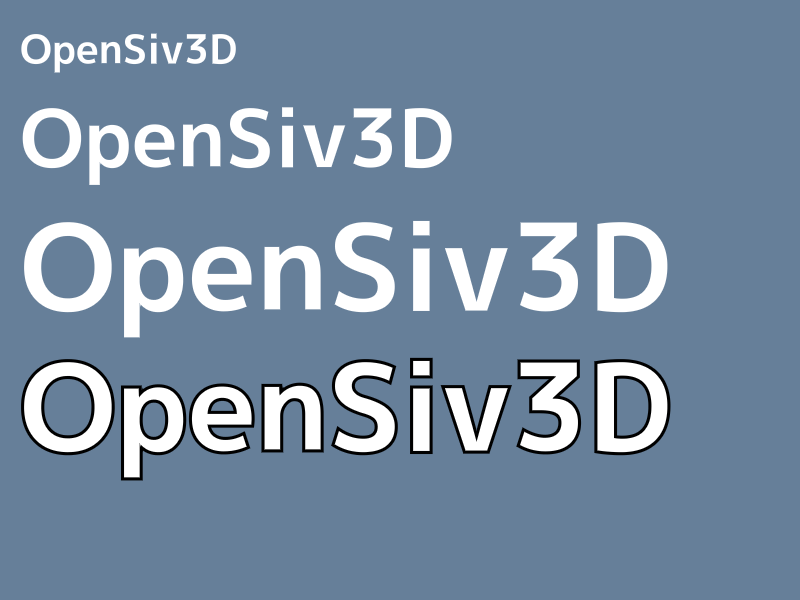

```C++
# include <Siv3D.hpp>

void Main()
{
	Scene::SetBackground(ColorF(0.4, 0.5, 0.6));

	// グリフごとの Distance field のサイズ
	const int32 distanceFieldSize = 60;
	
	// SDFFont
	const SDFFont sdfFont(distanceFieldSize, Typeface::Bold);

	const String text = U"OpenSiv3D";

	while (System::Update())
	{
		// SDF パラメータの設定
		Graphics2D::SetSDFParameters(sdfFont.pixelRange());
		sdfFont(text).draw(40, Vec2(20, 20));
		sdfFont(text).draw(80, Vec2(20, 80));
		sdfFont(text).draw(120, Vec2(20, 180));

		// SDF パラメータの設定、太らせを 0.2 に
		Graphics2D::SetSDFParameters(sdfFont.pixelRange(), 0.2);
		sdfFont(text).draw(120, Vec2(20, 320), Palette::Black);

		// SDF パラメータの設定、太らせを 0.0 に
		Graphics2D::SetSDFParameters(sdfFont.pixelRange(), 0.0);
		sdfFont(text).draw(120, Vec2(20, 320));
	}
}
```

### SDFFont の事前生成
`SDFFont` の各グリフの Distance field は、生成に時間がかかるため、使用するグリフをあらかじめ生成して保存しておくとアプリケーションの速度低下が防げます。`SDFFont::preload(s)` で、文字列 `s` 含まれるグリフの Distance field を生成、`SDFFont::preload(imagePath, jsonPath)` で 2 つのファイルに生成結果を保存し、`SDFFont` のコンストラクタでこれらのファイルをロードします。事前生成されていなかったグリフは実行時に生成されます。


```C++
# include <Siv3D.hpp>

void Main()
{
	Scene::SetBackground(ColorF(0.4, 0.5, 0.6));

	// グリフごとの Distance field のサイズ
	const int32 distanceFieldSize = 60;

	//////////////////////////////////////////
	//
	// SDFFont Distance field の事前生成
	//
	// ※ 保存できたら不要なのでコメントアウト
	{
		String s;
		for (auto i : Range(32, 126))
		{
			s << char32(i);
		}

		// SDF の作成には時間がかかるので、
		// ASCII 文字をあらかじめ SDF 化して、フォント情報を保存しておく
		SDFFont(distanceFieldSize, Typeface::Bold)
			.preload(s)
			.saveGlyphs(U"sdf-font/bold_60.png", U"sdf-font/bold_60.json");
	}
	//
	//////////////////////////////////////////
	
	// SDFFont を作成し、事前生成した Distance field をロード
	// フォントの種類や Distance field が一致しないといけない
	const SDFFont sdfFont({ U"sdf-font/bold_60.png", U"sdf-font/bold_60.json" }, distanceFieldSize, Typeface::Bold);

	if (!sdfFont) // ロードに失敗したら
	{
		throw Error(U"Failed to load SDFFont");
	}

	const String text = U"OpenSiv3D";

	while (System::Update())
	{
		// SDF パラメータの設定
		Graphics2D::SetSDFParameters(sdfFont.pixelRange());
		sdfFont(text).draw(120, Vec2(20, 20));
	}
}
```


### 比較用サンプル

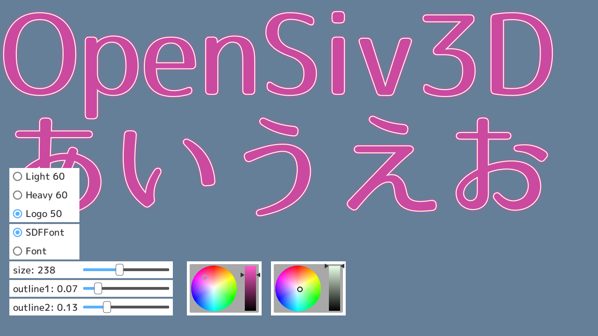

```C++
# include <Siv3D.hpp>

void Main()
{
	Window::Resize(1280, 720);
	Scene::SetBackground(ColorF(0.4, 0.5, 0.6));

	constexpr Vec2 pos(0, 0);
	const String text = U"OpenSiv3D\nあいうえお";

	//////////////////////////////////////////
	//
	// SDFFont Distance field の事前生成
	//
	// ※ 保存できたら不要なのでコメントアウト
	{
		String s;
		for (auto i : Range(32, 126))
		{
			s << char32(i);
		}
		s += text;

		// SDF の作成には時間がかかるので、
		// ASCII 文字と text をあらかじめ SDF 化して、フォント情報を保存しておく
		SDFFont(60, Typeface::Light).preload(s).saveGlyphs(U"sdf-font/light_60.png", U"sdf-font/light_60.json");
		SDFFont(60, Typeface::Heavy).preload(s).saveGlyphs(U"sdf-font/heavy_60.png", U"sdf-font/heavy_60.json");
		SDFFont(50, U"example/font/LogoTypeGothic/LogoTypeGothic.otf").preload(s).saveGlyphs(U"sdf-font/logo_50.png", U"sdf-font/logo_50.json");
	}
	//
	//////////////////////////////////////////

	// SDFFont を作成し、事前生成した Distance field をロード
	const Array<SDFFont> sdfFonts =
	{
		SDFFont({ U"sdf-font/light_60.png", U"sdf-font/light_60.json" }, 60, Typeface::Light),
		SDFFont({ U"sdf-font/heavy_60.png", U"sdf-font/heavy_60.json" }, 60, Typeface::Heavy),
		SDFFont({ U"sdf-font/logo_50.png", U"sdf-font/logo_50.json" }, 50, U"example/font/LogoTypeGothic/LogoTypeGothic.otf"),
	};

	for (const auto& sdfFont : sdfFonts)
	{
		if (!sdfFont) // ロードに失敗したら
		{
			throw Error(U"Failed to load SDFFont");
		}
	}

	// 比較用の通常 Font
	const Array<Font> fonts =
	{
		Font(60, Typeface::Light),
		Font(60, Typeface::Heavy),
		Font(50, U"example/font/LogoTypeGothic/LogoTypeGothic.otf"),
	};

	size_t fontIndex = 0, method = 0;
	double fontSize = 80, outline1 = 0.0, outline2 = 0.0;
	HSV innerColor = Palette::Black, outlineColor = Palette::White;

	while (System::Update())
	{
		const auto& sdfFont = sdfFonts[fontIndex];
		const auto& font = fonts[fontIndex];

		if (method == 0)
		{
			Graphics2D::SetSDFParameters(sdfFont.pixelRange(), outline2);
			sdfFont(text).draw(fontSize, pos, innerColor);

			Graphics2D::SetSDFParameters(sdfFont.pixelRange(), outline1);
			sdfFont(text).draw(fontSize, pos, outlineColor);

			Graphics2D::SetSDFParameters(sdfFont.pixelRange());
			sdfFont(text).draw(fontSize, pos, innerColor);
		}
		else if (method == 1)
		{
			Transformer2D tr(Mat3x2::Scale(fontSize / font.fontSize()));
			font(text).draw(pos, innerColor);
		}

		SimpleGUI::RadioButtons(fontIndex, { U"Light 60", U"Heavy 60", U"Logo 50" }, Vec2(20, 360), 150);
		SimpleGUI::RadioButtons(method, { U"SDFFont", U"Font" }, Vec2(20, 480), 150);
		SimpleGUI::Slider(U"size: {:.0f}"_fmt(fontSize), fontSize, 15, 550, Vec2(20, 560), 150, 200);
		SimpleGUI::Slider(U"outline1: {:.2f}"_fmt(outline1), outline1, 0.0, 0.49, Vec2(20, 600), 150, 200, (method == 0));
		SimpleGUI::Slider(U"outline2: {:.2f}"_fmt(outline2), outline2, 0.0, 0.49, Vec2(20, 640), 150, 200, (method == 0));
		SimpleGUI::ColorPicker(innerColor, Vec2(400, 560));
		SimpleGUI::ColorPicker(outlineColor, Vec2(580, 560));
	}
}
```


## 2. 集中線描画
実験的ライブラリ群 HamFramework に追加された `SaturatedLinework` クラスによって、コミカルな効果や疾走感を演出するための集中線を簡単に描画できるようになりました。設定するパラメータは、ターゲットの図形、外周の長方形、線の本数、線の太さ、長さのばらつき、乱数シードなどがあり、`.draw()` の引数で色を指定できます。多数の三角形を生成して描画する方法で表現されています。パラメータを変更しなければ、生成した三角形は再利用されます。


```C++
# include <Siv3D.hpp>
# include <HamFramework.hpp>

void Main()
{
	Scene::SetBackground(ColorF(0.98, 0.96, 0.94));

	// ターゲットの図形
	Ellipse target(400, 300, 180, 120);

	// 外周の長方形
	Rect outer = Scene::Rect();

	// 線の太さ
	double minThickness = 3.0, maxThickness = 10.0;
	
	// 線の本数
	double lineCount = 150;

	// 線の長さのばらつき
	double offsetRange = 60.0;

	// 乱数シード
	uint64 seed = 12345;

	SaturatedLinework<Ellipse> linework(target, outer);
	linework
		.setThickness(minThickness, maxThickness)
		.setLineCount(static_cast<size_t>(lineCount))
		.setOffsetRange(offsetRange);

	const Texture texture(Emoji(U"🦀"));

	while (System::Update())
	{
		if (MouseR.down())
		{
			target.setCenter(Cursor::Pos());
			linework.setTargetShape(target);
		}

		texture.scaled(1.6).drawAt(target.center);

		// 集中線を描画
		linework.draw(ColorF(0.1));

		if (SimpleGUI::Slider(U"lineCount", lineCount, 0.0, 400.0, Vec2(20, 20), 150))
		{
			linework.setLineCount(static_cast<size_t>(lineCount));
		}

		if (SimpleGUI::Slider(U"offsetRange", offsetRange, 0.0, 100.0, Vec2(20, 60), 150))
		{
			linework.setOffsetRange(offsetRange);
		}

		if (SimpleGUI::Button(U"Change seed", Vec2(20, 100)))
		{
			seed = RandomUint64();
			linework.setSeed(seed);
		}
	}
}
```


## 3. シリアル通信
シリアル通信を使って、外部デバイスとデータの送受信ができるようになりました。以下では Arduino UNO で LED の点灯/消灯を PC から制御し、合わせて 1 バイトの数値データをやり取りするサンプルを示します。

### Arduino のコード

```C++
void setup()
{
	pinMode(13, OUTPUT); // 13 ピン - LED - 抵抗 - GND

	// 9600bps でシリアルポートを開く
	Serial.begin(9600);
}

unsigned char i = 0; // テスト用に PC 側に送る値

void loop()
{
	// 250 ミリ秒止める
	delay(250);

	// シリアルポートに 1 バイト出力
	Serial.write(i);

	++i;

	// シリアル通信で受信したデータを読み込む
	const int val = Serial.read();

	if (val == -1) // 受信したデーが無い
	{
		return;
	}

	if (val == 0)
	{
		digitalWrite(13, LOW); // LOW を出力
	}
	else if (val == 1)
	{
		digitalWrite(13, HIGH); // HIGH を出力
	}
	else if (val == 2)
	{
		i = 0;
	}
}
```

### PC 側のコード

```C++
# include <Siv3D.hpp>

void Main()
{
	// シリアルポートの一覧を取得
	const Array<SerialPortInfo> infos = System::EnumerateSerialPorts();
	const Array<String> options = infos.map([](const SerialPortInfo& info)
	{
		return U"{} ({})"_fmt(info.port, info.description);
	}) << U"none";

	Serial serial;
	size_t index = (options.size() - 1);

	while (System::Update())
	{
		const bool isOpened = serial.isOpened();

		if (SimpleGUI::Button(U"Write 0", Vec2(200, 20), 120, isOpened))
		{
			// 1 バイトのデータ (0) を書き込む
			serial.writeByte(0);
		}

		if (SimpleGUI::Button(U"Write 1", Vec2(340, 20), 120, isOpened))
		{
			// 1 バイトのデータ (1) を書き込む
			serial.writeByte(1);
		}

		if (SimpleGUI::Button(U"Write 2", Vec2(480, 20), 120, isOpened))
		{
			// 1 バイトのデータ (2) を書き込む
			serial.writeByte(2);
		}

		if (SimpleGUI::RadioButtons(index, options, Vec2(200, 60)))
		{
			ClearPrint();

			if (index == (options.size() - 1))
			{
				serial = Serial();
			}
			else
			{
				Print << U"Open {}"_fmt(infos[index].port);

				// シリアルポートをオープン
				if (serial.open(infos[index].port))
				{
					Print << U"Succeeded";
				}
				else
				{
					Print << U"Failed";
				}
			}
		}

		if (const size_t available = serial.available())
		{
			// シリアル通信で受信したデータを読み込んで表示
			Print << U"READ: " << serial.readBytes();
		}
	}
}
```


## 4. PoissonDisk2D
ほどよい距離で重ならない点群を生成する `PoissonDisk2D` クラスが追加されました。

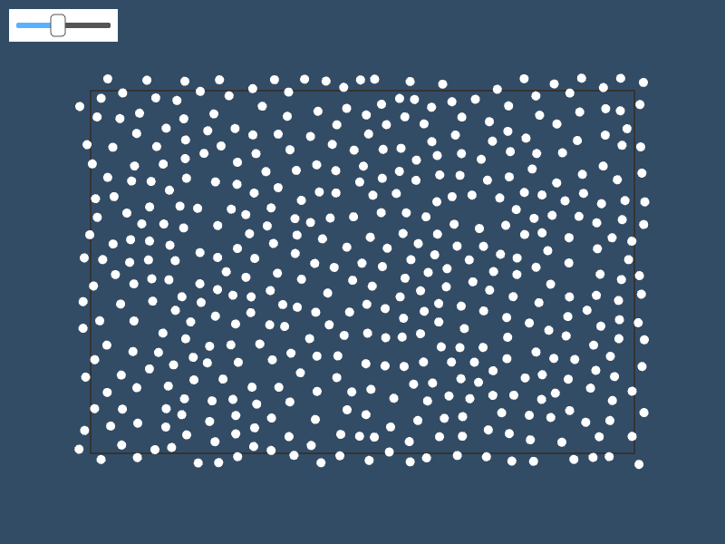

```C++
# include <Siv3D.hpp>

void Main()
{
	Scene::SetBackground(ColorF(0.2, 0.3, 0.4));

	const Rect rect(100, 100, 600, 400);

	double r = 15.0;

	// 点群を生成
	PoissonDisk2D pd(rect.size, r);

	while (System::Update())
	{
		rect.drawFrame(1, 1, ColorF(0.2));

		for (const auto& point : pd.getPoints())
		{
			Circle(point, r / 4).movedBy(rect.pos).draw();
		}

		if (SimpleGUI::Slider(r, 5.0, 40.0, Vec2(10, 10)))
		{
			pd = PoissonDisk2D(rect.size, r);
		}
	}
}
```


## 5. JSONWriter
成形された JSON ファイルを出力するヘルパークラスが追加されました。順次出力のため、実際に保存されるのと同じ順番でデータを出力をする必要があります。

```C++
# include <Siv3D.hpp>

void Main()
{
	JSONWriter json;

	json.startObject();
	{
		json.key(U"Window").startObject();
		{
			json.key(U"title").write(U"My application");
			json.key(U"width").write(800);
			json.key(U"height").write(600);
			json.key(U"sizable").write(false);
		}
		json.endObject();

		json.key(U"Scene").startObject();
		{
			json.key(U"background").write(ColorF(0.8, 0.9, 1.0));
		}
		json.endObject();

		json.key(U"Array").startObject();
		{
			json.key(U"values").writeArray({ 11, 22, 33, 44, 55 });
		}
		json.endObject();

		json.key(U"Items").startArray();
		{
			json.startObject();
			{
				json.key(U"label").write(U"Forest");

				json.key(U"pos").startObject();
				{
					json.key(U"x").write(100);
					json.key(U"y").write(100);
				}
				json.endObject();
			}
			json.endObject();

			json.startObject();
			{
				json.key(U"label").write(U"Ocean");

				json.key(U"pos").startObject();
				{
					json.key(U"x").write(300);
					json.key(U"y").write(200);
				}
				json.endObject();
			}
			json.endObject();

			json.startObject();
			{
				json.key(U"label").write(U"Mountain");

				json.key(U"pos").startObject();
				{
					json.key(U"x").write(500);
					json.key(U"y").write(100);
				}
				json.endObject();
			}
			json.endObject();
		}
		json.endArray();
	}
	json.endObject();

	// ここまでの内容を保存
	json.save(U"test.json");

	while (System::Update())
	{

	}
}
```

出力される JSON ファイル
```JSON
{
  "Window": {
    "title": "My application",
    "width": 800,
    "height": 600,
    "sizable": "false"
  },
  "Scene": {
    "background": "(0.8, 0.9, 1, 1)"
  },
  "Array": {
    "values": [
      11,
      22,
      33,
      44,
      55
    ]
  },
  "Items": [
    {
      "label": "Forest",
      "pos": {
        "x": 100,
        "y": 100
      }
    },
    {
      "label": "Ocean",
      "pos": {
        "x": 300,
        "y": 200
      }
    },
    {
      "label": "Mountain",
      "pos": {
        "x": 500,
        "y": 100
      }
    }
  ]
}
```


## 6. Geometry2D::IsClockwise()
頂点の配列が時計回りかどうかを判定する関数が追加されました。

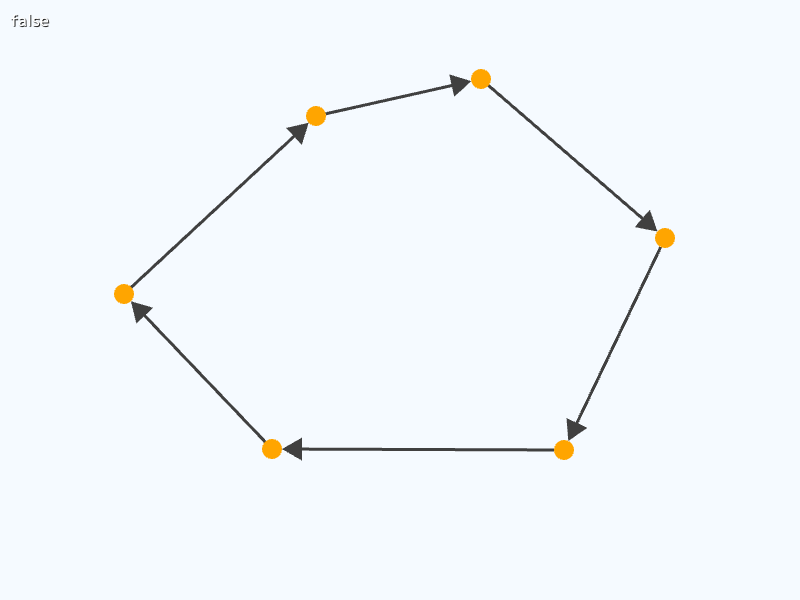

```C++
# include <Siv3D.hpp>

void Main()
{
	Scene::SetBackground(ColorF(0.96, 0.98, 1.0));
	
	Array<Vec2> points;

	while (System::Update())
	{
		if (MouseL.down())
		{
			points << Cursor::Pos();
		}

		if (MouseR.down())
		{
			points.clear();
		}

		const bool isClockwise = Geometry2D::IsClockwise(points);

		ClearPrint();
		Print << isClockwise;

		for (const auto& point : points)
		{
			Circle(point, 10).draw(Palette::Orange);
		}

		if (points.size() > 2)
		{
			// 時計回りになるように矢印でつなぐ
			if (isClockwise)
			{
				for (size_t i = 0; i < points.size(); ++i)
				{
					Line(points[i], points[(i + 1) % points.size()])
						.stretched(-10)
						.drawArrow(3, Vec2::All(20), ColorF(0.25));
				}
			}
			else
			{
				for (size_t i = 0; i < points.size(); ++i)
				{
					Line(points[i], points[(i + 1) % points.size()])
						.reversed()
						.stretched(-10)
						.drawArrow(3, Vec2::All(20), ColorF(0.25));
				}
			}
		}
	}
}
```


## 7. Circle::draw(innerColor, outerColor)
`Circle` や `Ellipse` で中心の色と外周の色を指定し、グラデーションで描画できるようになりました。

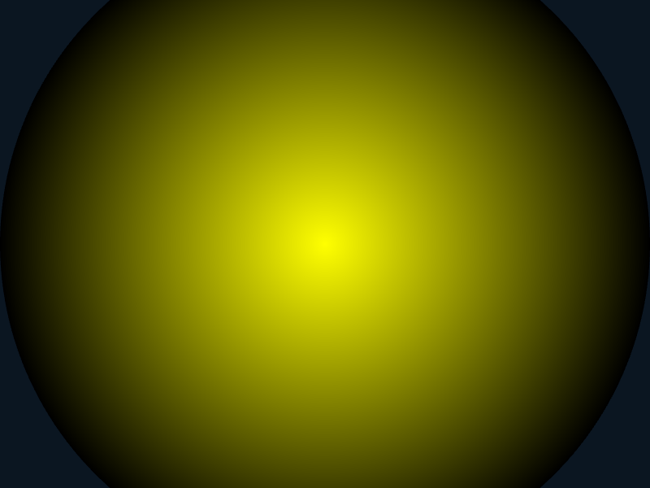

```C++
# include <Siv3D.hpp>

void Main()
{
	while (System::Update())
	{
		// 中心が黄色、外周が黒
		Circle(Scene::Center(), 400).draw(Palette::Yellow, Palette::Black);
	}
}
```


## 8. SimpleGUI::Headline / ColorPicker
SimpleGUI に、見出しを付けるヘッドラインと、色を選択するカラーピッカーが追加されました。

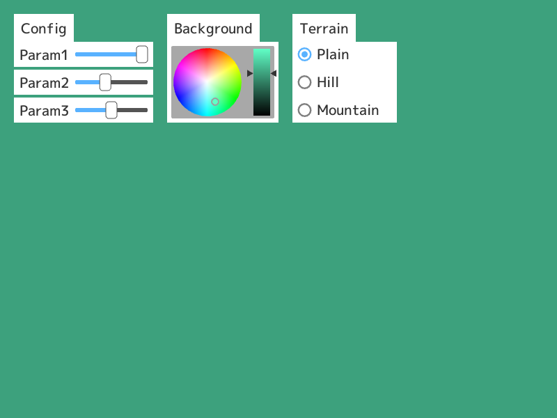

```C++
# include <Siv3D.hpp>

void Main()
{
	double p0 = 1.0, p1 = 0.4, p2 = 0.5;
	HSV hsv = Palette::Gray;
	size_t index = 0;

	while (System::Update())
	{
		Scene::SetBackground(hsv);

		// Headline
		SimpleGUI::Headline(U"Config", Vec2(20, 20));
		{
			SimpleGUI::Slider(U"Param1", p0, Vec2(20, 60));
			SimpleGUI::Slider(U"Param2", p1, Vec2(20, 100));
			SimpleGUI::Slider(U"Param3", p2, Vec2(20, 140));
		}

		SimpleGUI::Headline(U"Background", Vec2(240, 20));
		{
			// カラーピッカー
			SimpleGUI::ColorPicker(hsv, Vec2(240, 60));
		}

		SimpleGUI::Headline(U"Terrain", Vec2(420, 20));
		{
			SimpleGUI::RadioButtons(index, { U"Plain", U"Hill", U"Mountain" }, Vec2(420, 60), 150);
		}
	}
}
```


## 9. ToastNotification
Windows でトースト通知を出せるようになりました。

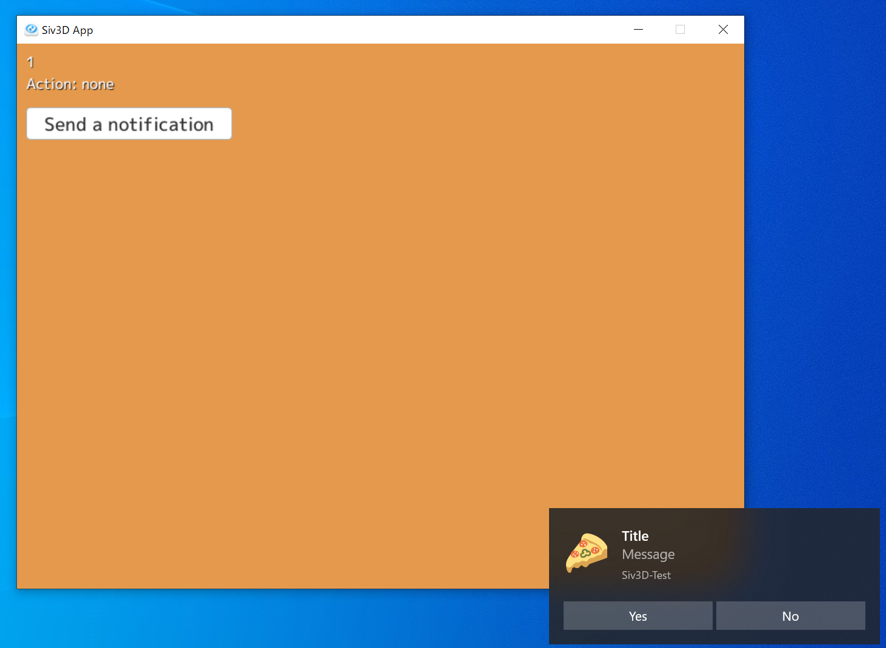

```C++
# include <Siv3D.hpp>

void Main()
{
	Scene::SetBackground(ColorF(0.9, 0.6, 0.3));
	
	// 通知ごとに割り振られる ID
	NotificationID latest = -1;

	// 画像を作成・保存
	Emoji::CreateImage(U"🍕").save(U"pizza.png");

	while (System::Update())
	{
		ClearPrint();

		// 通知の状態
		Print << (int32)Platform::Windows::ToastNotification::GetState(latest);

		// アクションボタンの結果
		Print << U"Action: " << Platform::Windows::ToastNotification::GetAction(latest);

		if (SimpleGUI::Button(U"Send a notification", Vec2(10, 70)))
		{
			ToastNotificationProperty toast{
				.title = U"Title", // 通知のタイトル
				.message = U"Message", // 通知の本文
				.imagePath = U"pizza.png", // 大きい画像だと使われないことがある
				.actions = { U"Yes", U"No" } // アクションボタン（不要な場合は設定しない）
			};

			// 通知ごとに割り振られる ID を取得
			latest = Platform::Windows::ToastNotification::Show(toast);
		}
	}
}
```


## 10. SimpleGUIManager
TOML ファイルに SimpleGUI の各ウィジェットを記述し、プログラムでロードできるようになります。実行中に操作した値を保存することもできます。

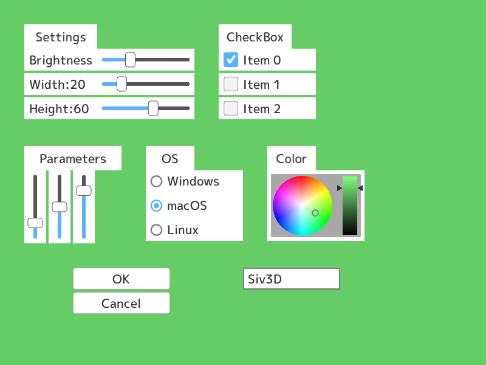

```C++
# include <Siv3D.hpp>

void Main()
{
	// SimpleGUI のウィジェット情報を記述したファイル
	const FilePath tomlPath = FileSystem::FullPath(U"example/gui/gui.toml");
	
	// 更新を検知
	const DirectoryWatcher watcher(FileSystem::ParentPath(tomlPath));
	
	// GUI をロード
	SimpleGUIManager gui(tomlPath);

	while (System::Update())
	{
		// TOML が更新されたら GUI を再ロード
		for (const auto& change : watcher.retrieveChanges())
		{
			if (change.first == tomlPath && change.second == FileAction::Modified)
			{
				ClearPrint();
				gui.load(tomlPath);
			}
		}

		// GUI を更新・描画
		gui.draw();

		if (gui.button(U"bt-OK")) // "bt-OK" という名前のボタンが押された
		{
			Print << U"OK";
		}
		else if (gui.button(U"bt-Cancel")) // "bt-Cancel" という名前のボタンが押された
		{
			Print << U"Cancel";
		}

		Scene::SetBackground(gui.colorPicker(U"cp-Color")); // "cp-Color という名前のカラーピッカーの値 
	}

	// ウィジェット情報と値を save.toml という名前で保存する
	// これを SimpleGUIManager で読み込ませることもできる
	//gui.save(U"save.toml");
}
```


## 11. Print の排他制御
デバッグなどの用途のために、`Print` を複数スレッドから同時に呼び出し可能になりました。

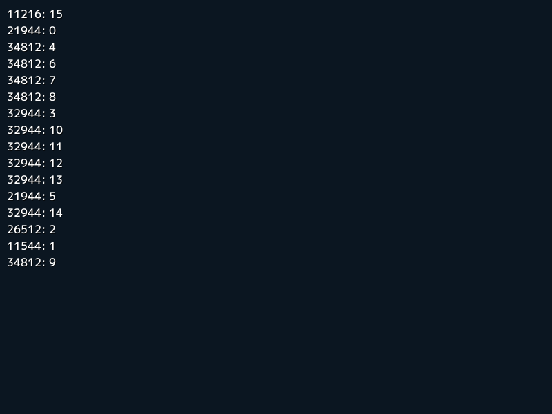

```C++
// Siv3D の並列処理関数を有効化するマクロ
// ヘッダが増えるためコンパイル時間が少し長くなる
# define SIV3D_CONCURRENT
# include <Siv3D.hpp>

void Main()
{
	// 0～15 の数に対して、複数スレッドで処理
	Range(0, 15).parallel_each([](int32 i)
	{
		// スレッド識別子を合わせて表示
		Print << U"{}: {}"_fmt(std::this_thread::get_id(), i);
	});

	while (System::Update())
	{

	}
}
```


## 12. 3D 形状
`Quaternion`, `OBB` が追加されました。`Ray` と各種 3D 形状との交差判定もいくつか追加されました。

ただし v0.4.1 と同様、2D 描画で 3D をエミュレートする簡易的なものなので、次のような制約があります。

- 深度バッファが無いので前後判定ができない
- 遠近クリップが無いのでカメラに近すぎるオブジェクトが正しく表示されない


```C++
# include <Siv3D.hpp>

void Main()
{
	constexpr double fov = 45_deg;
	constexpr Vec3 focusPosition(0, 0, 0);
	Vec3 eyePosition(0, 10, 0);
	experimental::BasicCamera3D camera(Scene::Size(), fov, eyePosition, focusPosition);

	Array<OBB> objects;

	for (auto x : Range(-2, 2))
	{
		for (auto z : Range(2, -2, -1))
		{
			objects << OBB(Vec3(x * 4, 1, z * 4), Vec3(3, 2, 0.5), Quaternion::RollPitchYaw(0, x * 30_deg, 0));
			objects << OBB(Vec3(x * 4, 5, z * 4), Vec3(2, 1, 2), Quaternion::RollPitchYaw(x * 30_deg, 0, 0));
		}
	}

	while (System::Update())
	{
		eyePosition = Cylindrical(20, Scene::Time() * 30_deg, 8 + Periodic::Sine0_1(4s) * 8);
		camera.setView(eyePosition, focusPosition);
		const Mat4x4 mat = camera.getMat4x4();

		{
			ScopedRenderStates2D culling(RasterizerState::SolidCullBack);

			for (auto i : Range(-10, 10))
			{
				Line3D(Vec3(-10, 0, i), Vec3(10, 0, i)).draw(mat, ColorF(0.5));
				Line3D(Vec3(i, 0, -10), Vec3(i, 0, 10)).draw(mat, ColorF(0.5));
			}

			const Vec3 eyePos = camera.getEyePosition();
			const Vec3 rayEnd = camera.screenToWorldPoint(Cursor::Pos(), 0.5f);
			const Ray cursorRay(eyePos, (rayEnd - eyePos).normalized());

			objects.sort_by([&](const OBB& a, const OBB& b)
			{
				return (eyePos.distanceFromSq(a.center)) > (eyePos.distanceFromSq(b.center));
			});

			Optional<size_t> intersectionIndex;

			for (auto [i, object] : IndexedReversed(objects))
			{
				if (cursorRay.intersects(object))
				{
					intersectionIndex = i;
					Cursor::RequestStyle(CursorStyle::Hand);
					break;
				}
			}

			for (auto [i, object] : Indexed(objects))
			{
				const HSV color((object.center.x * 50 + object.center.z * 10), 1.0, (i == intersectionIndex) ? 1.0 : 0.3);
				object.draw(mat, color);
			}
		}
	}
}
```

### v0.4.1 サンプルアップデート
`AABB`, `Triangle3D`, `Line3D` などが、`s3d::experimental` 名前空間から `s3d` 名前空間に移動しました。

#### 3D Triangles

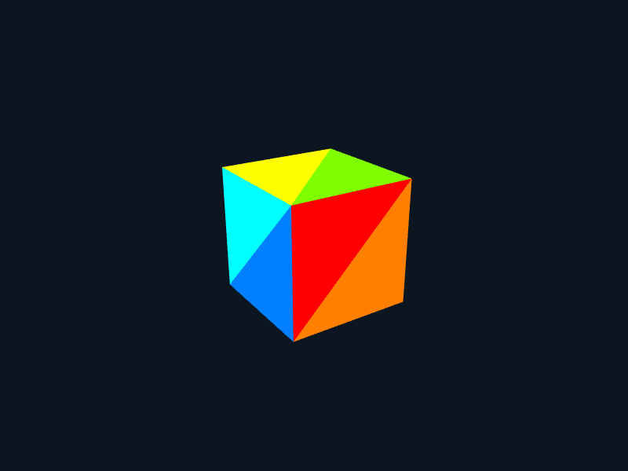

```C++
# include <Siv3D.hpp>

void Main()
{
	constexpr std::array<Vec3, 8> vertices =
	{
		Vec3(-1, 1, -1),
		Vec3(1, 1, -1),
		Vec3(-1, -1, -1),
		Vec3(1, -1, -1),
		Vec3(1, 1, 1),
		Vec3(-1, 1, 1),
		Vec3(1, -1, 1),
		Vec3(-1, -1, 1),
	};

	constexpr std::array<uint32, 36> indices =
	{
		0, 1, 2, 2, 1, 3,
		5, 4, 0, 0, 4, 1,
		1, 4, 3, 3, 4, 6,
		5, 0, 7, 7, 0, 2,
		4, 5, 6, 6, 5, 7,
		2, 3, 7, 7, 3, 6,
	};

	constexpr double fov = 45_deg;
	constexpr Vec3 focusPosition(0, 0, 0);
	Vec3 eyePosition(0, 4, 0);
	experimental::BasicCamera3D camera(Scene::Size(), fov, eyePosition, focusPosition);

	while (System::Update())
	{
		eyePosition = Cylindrical(8, Scene::Time() * 30_deg, Math::Sin(Scene::Time()) * 4);
		camera.setView(eyePosition, focusPosition);
		const Mat4x4 mat = camera.getMat4x4();

		{
			ScopedRenderStates2D culling(RasterizerState::SolidCullBack);

			for (auto i : step(12))
			{
				const Vec3 p0(vertices[indices[i * 3 + 0]]);
				const Vec3 p1(vertices[indices[i * 3 + 1]]);
				const Vec3 p2(vertices[indices[i * 3 + 2]]);

				Triangle3D(p0, p1, p2).draw(mat, HSV(i * 30));
			}
		}
	}
}
```

#### 3D AABB

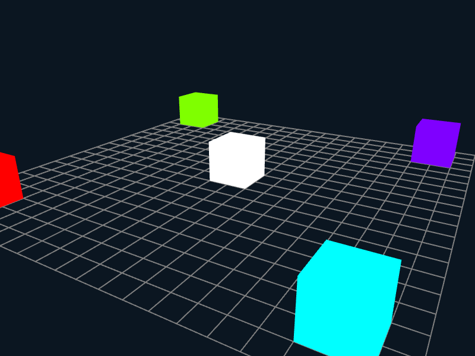

```C++
# include <Siv3D.hpp>

void Main()
{
	constexpr double fov = 45_deg;
	constexpr Vec3 focusPosition(0, 0, 0);
	Vec3 eyePosition(0, 10, 0);
	experimental::BasicCamera3D camera(Scene::Size(), fov, eyePosition, focusPosition);

	while (System::Update())
	{
		eyePosition = Cylindrical(20, Scene::Time() * 30_deg, 8 + Periodic::Sine0_1(4s) * 8);
		camera.setView(eyePosition, focusPosition);
		const Mat4x4 mat = camera.getMat4x4();

		{
			ScopedRenderStates2D culling(RasterizerState::SolidCullBack);

			for (auto i : Range(-10, 10))
			{
				Line3D(Vec3(-10, 0, i), Vec3(10, 0, i)).draw(mat, ColorF(0.5));
				Line3D(Vec3(i, 0, -10), Vec3(i, 0, 10)).draw(mat, ColorF(0.5));
			}

			AABB(Vec3(0, 1, 0), Vec3(2, 2, 2)).draw(mat, Palette::White);
			AABB(Vec3(-8, 1, 8), Vec3(2, 2, 2)).draw(mat, HSV(0));
			AABB(Vec3(8, 1, 8), Vec3(2, 2, 2)).draw(mat, HSV(90));
			AABB(Vec3(8, 1, -8), Vec3(2, 2, 2)).draw(mat, HSV(270));
			AABB(Vec3(-8, 1, -8), Vec3(2, 2, 2)).draw(mat, HSV(180));
		}
	}
}
```

#### 3D Terrain

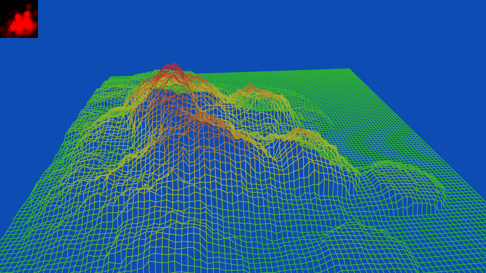

```C++
# include <Siv3D.hpp>

void Main()
{
	Window::Resize(1280, 720);
	Scene::SetBackground(ColorF(0.05, 0.3, 0.7));

	RenderTexture rt(100, 100, ColorF(0.0), TextureFormat::R32_Float);
	Grid<float> heightMap;
	Grid<Float3> positions;

	constexpr double fov = 45_deg;
	constexpr Vec3 focusPosition(50, 0, -50);
	Vec3 eyePosition(0, 100, 0);
	experimental::BasicCamera3D camera(Scene::Size(), fov, eyePosition, focusPosition);

	while (System::Update())
	{
		eyePosition = Cylindrical(Arg::r = 80, Arg::phi = Scene::Time() * 30_deg, Arg::y = 50) + Vec3(50, 0, -50);
		camera.setView(eyePosition, focusPosition);
		const Mat4x4 mat = camera.getMat4x4();

		rt.read(heightMap);
		{
			positions.resize(heightMap.size());

			for (auto p : step(heightMap.size()))
			{
				positions[p] = Float3(p.x, heightMap[p], -p.y);
			}
		}

		{
			ScopedRenderTarget2D target(rt);
			ScopedRenderStates2D blend(BlendState::Additive);

			if (MouseL.pressed())
			{
				Circle(Cursor::Pos(), 8).draw(ColorF(Scene::DeltaTime() * 24.0));
			}
		}

		if (positions)
		{
			ScopedRenderStates2D culling(RasterizerState::SolidCullBack);

			for (auto x : step(positions.width() - 1))
			{
				for (auto y : step(positions.height()))
				{
					const Float3 begin = positions[{x, y}];
					const Float3 end = positions[{x + 1, y}];
					const ColorF color = HSV(120 - (begin.y + end.y) * 3, 0.75, 0.7);
					Line3D(begin, end).draw(mat, color);
				}
			}

			for (auto x : step(positions.width()))
			{
				for (auto y : step(positions.height() - 1))
				{
					const Float3 begin = positions[{x, y}];
					const Float3 end = positions[{x, y + 1}];
					const ColorF color = HSV(120 - (begin.y + end.y) * 3, 0.75, 0.7);
					Line3D(begin, end).draw(mat, color);
				}
			}
		}

		rt.draw(ColorF(0.1));
	}
}
```


## 13. Microphone 不具合修正
macOS など一部の環境でマイクが使えなかった不具合を修正しました。

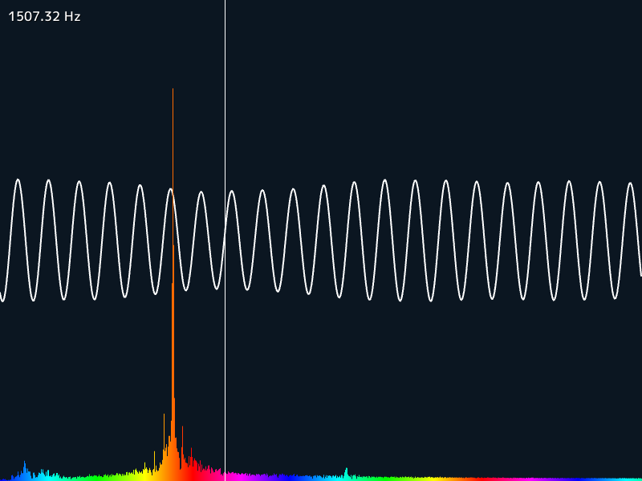

```C++
# include <Siv3D.hpp>

void Main()
{
	// マイクをセットアップ
	Microphone mic(unspecified); // unspecified を指定すると既定の音声入力デバイスを選択

	if (!mic)
	{
		// マイクを利用できない場合、終了
		throw Error(U"Microphone not available");
	}

	// 録音をスタート
	mic.start();

	LineString points(800);

	FFTResult fft;

	while (System::Update())
	{
		// 波形を可視化
		{
			const size_t pos = mic.posSample();
			const Array<WaveSampleS16>& buffer = mic.getBuffer();
			const size_t bufferLength = buffer.size();

			for (size_t i = 0; i < points.size(); ++i)
			{
				const size_t bufferPos = (pos + bufferLength - (800 - i)) % bufferLength;
				const double value = buffer[bufferPos].left / 32768.0;
				points[i].set(i, 300 - value * 300);
			}

			points.draw(2);
		}

		// 周波数スペクトラムを取得
		mic.fft(fft);

		// 周波数スペクトラム結果を可視化
		for (auto i : step(800))
		{
			const double size = Pow(fft.buffer[i], 0.6f) * 1200;
			RectF(Arg::bottomLeft(i, 600), 1, size).draw(HSV(240 - i));
		}

		// 周波数スペクトラム上に周波数を表示
		Rect(Cursor::Pos().x, 0, 1, Scene::Height()).draw();
		ClearPrint();
		Print << U"{} Hz"_fmt(Cursor::Pos().x * fft.resolution);
	}
}
```


## 14. QRDecoder 不具合修正
複数の QR コードの検出の不具合を修正しました。

```C++
# include <Siv3D.hpp>

void Main()
{
	Window::Resize(1280, 720);

	// Web カメラを起動
	Webcam webcam(0);
	webcam.setResolution(1280, 720);
	if (!webcam.start())
	{
		throw Error(U"");
	}

	Image image;
	DynamicTexture texture;
	QRDecoder qrDecoder;
	Array<std::pair<Quad, bool>> quads;

	while (System::Update())
	{
		// 新しい撮影フレームを取得
		if (webcam.hasNewFrame())
		{
			webcam.getFrame(image);

			Array<QRContent> qrs;

			// QR コードを検出
			qrDecoder.decode(image, qrs);

			quads.clear();

			for (const auto& qr : qrs)
			{
				quads.emplace_back(qr.quad, qr.isValid());

				// データの読み込みに成功した場合テキストを表示
				if (qr.isValid())
				{
					Print << qr.text;
				}
			}

			texture.fill(image);
		}

		texture.draw();

		// QR コードの領域を表示
		// データの読み込みに成功した場合赤色
		for (const auto& quad : quads)
		{
			quad.first.drawFrame(6, quad.second ? Palette::Red : Palette::Gray);
		}
	}
}
```


## 15. RenderTexture, MSRenderTexture 改善
`RenderTexture` や `MSRenderTexture` の `.clear()`, `.read()`, `.resolve()` が const メンバ関数に修正され、使いやすくなりました。  
（サンプル省略）
