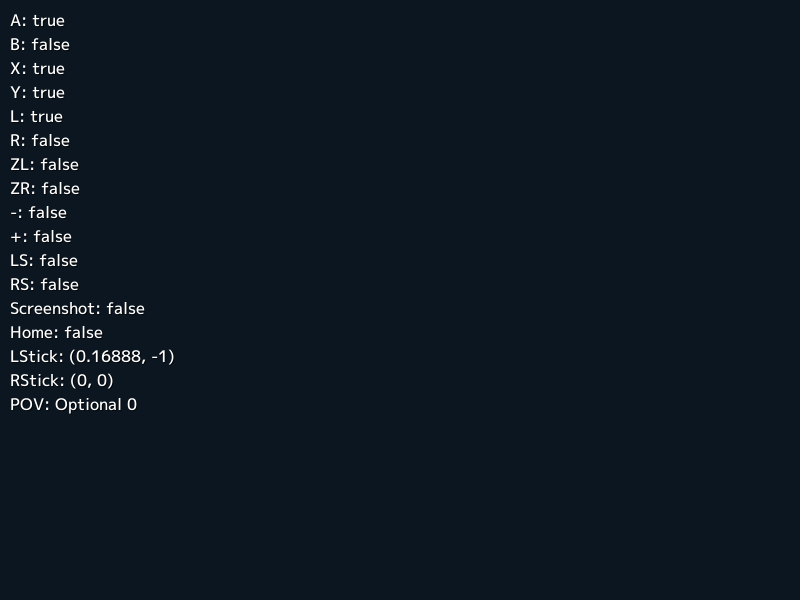
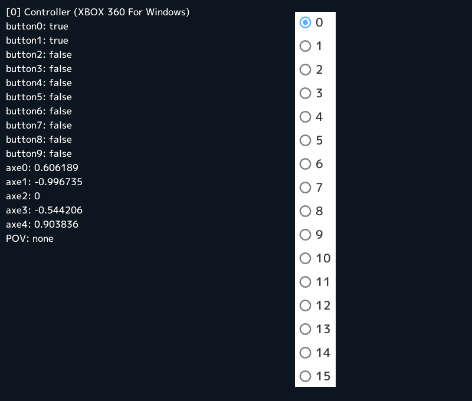

# ゲームパッド

## XInput 対応コントローラ
PC に接続されている XInput 対応コントローラには `XInput` を通してアクセスできます。

<video src="../images/gamepad-xbox.mp4" autoplay loop muted></video>
```C++
# include <Siv3D.hpp>

void Main()
{
	Window::Resize(640, 480);
	constexpr ColorF background(0.6, 0.8, 0.7);
	Scene::SetBackground(background);

	constexpr Ellipse buttonLB(160, 140, 50, 24);
	constexpr Ellipse buttonRB(520, 140, 50, 24);

	constexpr RectF leftTrigger(150, 16, 40, 100);
	constexpr RectF rightTrigger(500, 16, 40, 100);

	constexpr Circle buttonLThumb(170, 250, 35);
	constexpr Circle buttonRThumb(420, 350, 35);
	constexpr Circle buttonDPad(260, 350, 40);

	constexpr Circle buttonA(510, 300, 20);
	constexpr Circle buttonB(560, 250, 20);
	constexpr Circle buttonX(460, 250, 20);
	constexpr Circle buttonY(510, 200, 20);
	constexpr Circle buttonBack(270, 250, 15);
	constexpr Circle buttonStart(410, 250, 15);

	// ユーザインデックス (0 - 3)
	size_t userIndex = 0;

	// デッドゾーンの有効無効
	bool deadZone = false;

	// 振動 (0.0 - 1.0)
	double leftV = 0.0, rightV = 0.0;

	while (System::Update())
	{
		// 指定したユーザインデックスの XInput コントローラを取得
		auto controller = XInput(userIndex);

		if (deadZone)
		{
			controller.setLeftTriggerDeadZone();
			controller.setRightTriggerDeadZone();
			controller.setLeftThumbDeadZone();
			controller.setRightThumbDeadZone();
		}
		else
		{
			controller.setLeftTriggerDeadZone(DeadZone::Disabled());
			controller.setRightTriggerDeadZone(DeadZone::Disabled());
			controller.setLeftThumbDeadZone(DeadZone::Disabled());
			controller.setRightThumbDeadZone(DeadZone::Disabled());
		}

		// 振動
		controller.setVibration(leftV, rightV);

		buttonLB.draw(ColorF(controller.buttonLB.pressed() ? 1.0 : 0.7));
		buttonRB.draw(ColorF(controller.buttonRB.pressed() ? 1.0 : 0.7));

		Ellipse(340 + 3.0 * Random(leftV + rightV), 480, 300, 440).draw(ColorF(0.9));
		Ellipse(340, 40, 220, 120).draw(background);
		Circle(340, 660, 240).draw(background);

		Circle(340, 250, 30).draw(ColorF(0.6));

		// コントローラの接続の有無
		if (controller.isConnected())
		{
			Circle(340, 250, 32).drawPie(-0.5_pi + 0.5_pi * controller.userIndex, 0.5_pi, ColorF(0.7, 1.0, 0.5));
		}

		Circle(340, 250, 25).draw(ColorF(0.6));

		leftTrigger.draw(AlphaF(0.25));
		leftTrigger.stretched((controller.leftTrigger - 1.0) * leftTrigger.h, 0, 0, 0).draw();

		rightTrigger.draw(AlphaF(0.25));
		rightTrigger.stretched((controller.rightTrigger - 1.0) * rightTrigger.h, 0, 0, 0).draw();

		buttonLThumb.draw(ColorF(controller.buttonLThumb.pressed() ? 0.85 : 0.5));
		Circle(buttonLThumb.center + Vec2(controller.leftThumbX, -controller.leftThumbY) * 25, 20).draw();

		buttonRThumb.draw(ColorF(controller.buttonRThumb.pressed() ? 0.85 : 0.5));
		Circle(buttonRThumb.center + Vec2(controller.rightThumbX, -controller.rightThumbY) * 25, 20).draw();

		buttonDPad.draw(ColorF(0.5));

		const Vec2 direction(
			controller.buttonRight.pressed() - controller.buttonLeft.pressed(),
			controller.buttonDown.pressed() - controller.buttonUp.pressed());

		if (!direction.isZero())
		{
			Circle(buttonDPad.center + direction.normalized() * 25, 15).draw();
		}

		buttonA.draw(ColorF(0.0, 1.0, 0.3).setA(controller.buttonA.pressed() ? 1.0 : 0.3));
		buttonB.draw(ColorF(1.0, 0.0, 0.3).setA(controller.buttonB.pressed() ? 1.0 : 0.3));
		buttonX.draw(ColorF(0.0, 0.3, 1.0).setA(controller.buttonX.pressed() ? 1.0 : 0.3));
		buttonY.draw(ColorF(1.0, 0.5, 0.0).setA(controller.buttonY.pressed() ? 1.0 : 0.3));

		buttonBack.draw(ColorF(controller.buttonBack.pressed() ? 1.0 : 0.7));
		buttonStart.draw(ColorF(controller.buttonStart.pressed() ? 1.0 : 0.7));

		SimpleGUI::RadioButtons(userIndex, { U"1P", U"2P", U"3P", U"4P" }, Vec2(10, 10));
		SimpleGUI::CheckBox(deadZone, U"DeadZone", Vec2(240, 10));
		SimpleGUI::Slider(U"left", leftV, Vec2(240, 50));
		SimpleGUI::Slider(U"right", rightV, Vec2(240, 90));
	}
}
```


## Joy-Con
PC に接続されている Nintendo Switch の Joy-Con の情報は `JoyConL` または `JoyConR` を通して取得できます。

<video src="../images/gamepad-joycon.mp4" autoplay loop muted></video>

```C++
# include <Siv3D.hpp>

void Main()
{
	Scene::SetBackground(ColorF(0.9));
	Window::Resize(1280, 720);
	Effect effect;

	Vec2 left(640 - 100, 100), right(640 + 100, 100);
	double angle = 0_deg;
	double scale = 400.0;
	bool covered = true;

	while (System::Update())
	{
		Circle(Vec2(640 - 300, 450), scale / 2).drawFrame(scale * 0.1);
		Circle(Vec2(640 + 300, 450), scale / 2).drawFrame(scale * 0.1);

		// Joy-Con (L) を取得
		if (const auto joy = JoyConL(0))
		{
			joy.drawAt(Vec2(640 - 300, 450), scale, -90_deg - angle, covered);

			if (auto d = joy.povD8())
			{
				left += Circular(4, *d * 45_deg);
			}

			if (joy.button2.down())
			{
				effect.add([center = left](double t) {
					Circle(center, 20 + t * 200).drawFrame(10, 0, AlphaF(1.0 - t));
					return t < 1.0;
					});
			}
		}

		// Joy-Con (R) を取得
		if (const auto joy = JoyConR(0))
		{
			joy.drawAt(Vec2(640 + 300, 450), scale, 90_deg + angle, covered);

			if (auto d = joy.povD8())
			{
				right += Circular(4, *d * 45_deg);
			}

			if (joy.button2.down())
			{
				effect.add([center = right](double t) {
					Circle(center, 20 + t * 200).drawFrame(10, 0, AlphaF(1.0 - t));
					return t < 1.0;
					});
			}
		}

		Circle(left, 30).draw(ColorF(0.0, 0.75, 0.9));
		Circle(right, 30).draw(ColorF(1.0, 0.4, 0.3));
		effect.update();

		SimpleGUI::Slider(U"Rotation: ", angle, -180_deg, 180_deg, Vec2(20, 20), 120, 200);
		SimpleGUI::Slider(U"Scale: ", scale, 100.0, 600.0, Vec2(20, 60), 120, 200);
		SimpleGUI::CheckBox(covered, U"Covered", Vec2(20, 100));
	}
}
```


## Pro コントローラー
PC に接続されている Nintendo Switch の Pro コントローラーの情報は `ProController` を通して取得できます。



```C++
# include <Siv3D.hpp>

void Main()
{
	while (System::Update())
	{
		ClearPrint();

		// Pro コントローラーを取得
		if (const auto pro = ProController(0))
		{
			// 各ボタンの状態を表示
			Print << U"A: " << pro.buttonA.pressed();
			Print << U"B: " << pro.buttonB.pressed();
			Print << U"X: " << pro.buttonX.pressed();
			Print << U"Y: " << pro.buttonY.pressed();
			Print << U"L: " << pro.buttonL.pressed();
			Print << U"R: " << pro.buttonR.pressed();
			Print << U"ZL: " << pro.buttonZL.pressed();
			Print << U"ZR: " << pro.buttonZR.pressed();
			Print << U"-: " << pro.buttonMinus.pressed();
			Print << U"+: " << pro.buttonPlus.pressed();
			Print << U"LS: " << pro.buttonLStick.pressed();
			Print << U"RS: " << pro.buttonRStick.pressed();
			Print << U"Screenshot: " << pro.buttonScreenshot.pressed();
			Print << U"Home: " << pro.buttonHome.pressed();
			Print << U"LStick: " << pro.LStick();
			Print << U"RStick: " << pro.RStick();
			Print << U"POV: " << pro.povD8();
		}
		else
		{
			Print << U"No Pro Controller found";
		}
	}
}
```


## ゲームパッド
あらゆる種類のゲームパッドの情報を取得できる汎用的なクラスが `Gamepad` です。ユーザインデックスは `Gamepad.MaxUserCount - 1` で定義される 15 が最大値です。



```C++
# include <Siv3D.hpp>

void Main()
{
	Window::Resize(800, 680);

	size_t userIndex = 0;
	const Array<String> indices = Iota(Gamepad.MaxUserCount).map(Format);

	while (System::Update())
	{
		ClearPrint();

		if (const auto gamepad = Gamepad(userIndex))
		{
			Print << U"[{}] {}"_fmt(gamepad.getInfo().index, gamepad.getInfo().name);

			for (auto [i, button] : Indexed(gamepad.buttons))
			{
				Print << U"button{}: {}"_fmt(i, button.pressed());
			}

			for (auto [i, axe] : Indexed(gamepad.axes))
			{
				Print << U"axe{}: {}"_fmt(i, axe);
			}

			Print << U"POV: " << gamepad.povD8();
		}

		SimpleGUI::RadioButtons(userIndex, indices, Vec2(500, 20));
	}
}
```


## 接続されているゲームパッドの列挙

```C++
# include <Siv3D.hpp>

void Main()
{
	for (const auto& info : System::EnumerateGamepads())
	{
		Print << U"[{}] {}"_fmt(info.index, info.name);
	}

	while (System::Update())
	{

	}
}
```
