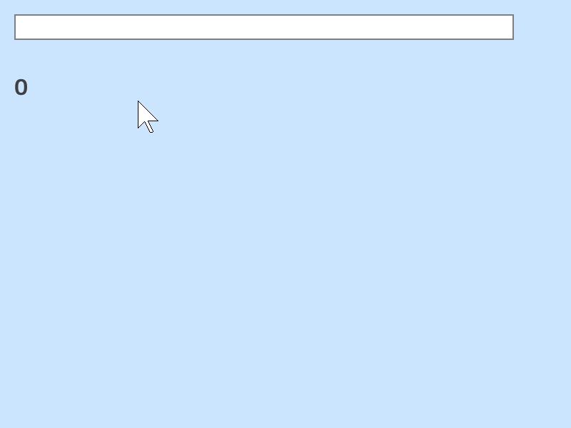

# 数式処理

## 数式の計算
`Eval()` に数式を渡すと、`double` 型の精度での計算結果を返します。`EvalOpt()` は戻り値の型が `Optional<double>` で、数式にエラーがある場合は `none` を返します。



```C++
# include <Siv3D.hpp>

void Main()
{
	Scene::SetBackground(ColorF(0.8, 0.9, 1.0));

	const Font font(30, Typeface::Bold);

	TextEditState tes;

	Optional<double> result = 0.0;

	while (System::Update())
	{
		// 数式を入力するテキストボックス
		if (SimpleGUI::TextBox(tes, Vec2(20, 20), 700))
		{
			// 結果を取得（エラーの場合 none）
			result = EvalOpt(tes.text);
		}

		if (result)
		{
			font(result.value()).draw(Rect(20, 100, 760, 500), ColorF(0.25));
		}
		else
		{
			font(U"Error").draw(20, 100, ColorF(0.25));
		}
	}
}
```


