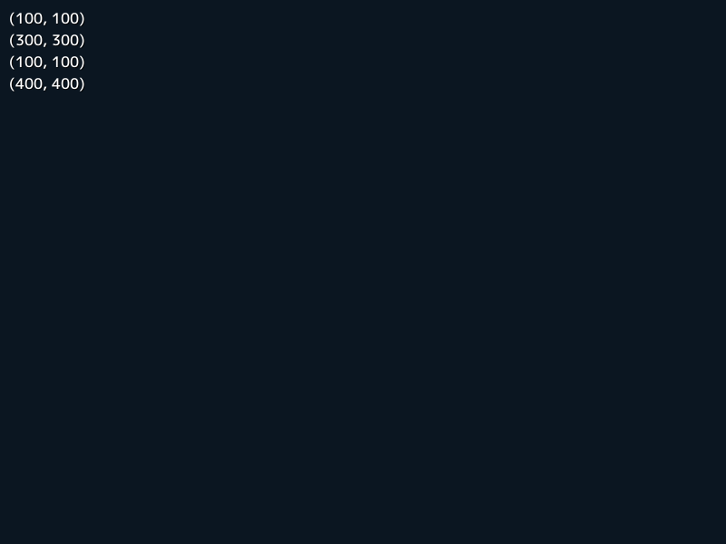
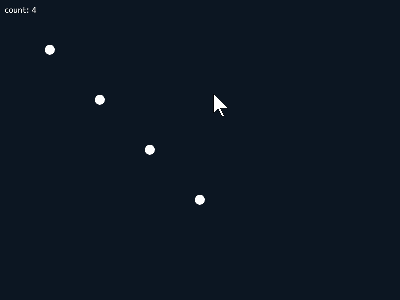
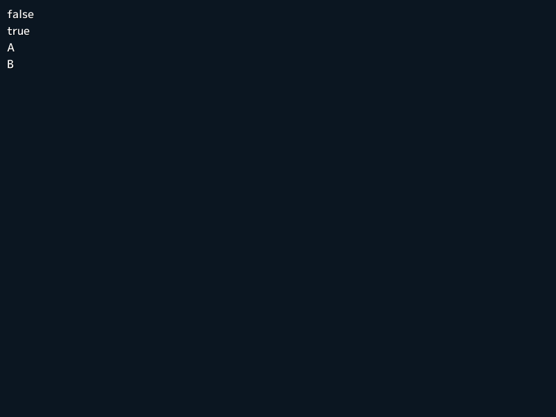
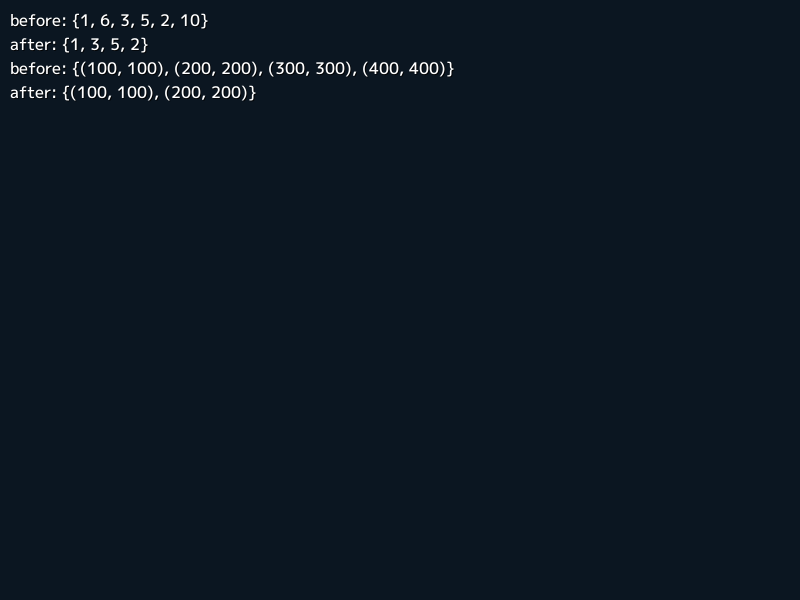
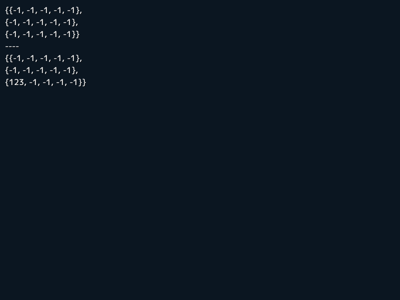

# 6. データ構造
この章では、Siv3D でゲームやアプリケーションを実装するうえで重要な、動的配列や二次元配列、文字列、ハッシュテーブルなど基本的なデータ構造のクラスを学びます。

## 6.1 動的配列
Siv3D で動的配列を扱うときは `Array<Type>` クラステンプレートを使います。`std::vector` よりも多くの便利なメンバ関数を提供し、Siv3D のクラスや関数とも連係しやすいため、優れた実行時性能と、コードの短縮につながります。`std::vector` と同様にメモリの連続性が保証されています。

### 要素の追加
`Array` には `<<` 演算子で要素を追加できます。


```C++
# include <Siv3D.hpp>

void Main()
{
	Array<Vec2> points;

	while (System::Update())
	{
		if (MouseL.down())
		{
			// 配列に要素を追加
			points << Cursor::Pos();
		}

		for (const auto& point : points)
		{
			Circle(point, 10).draw();
		}
	}
}
```


### 特定の要素にアクセス
`[]` を使って 0 から始まるインデックスを指定することで、配列の要素にアクセスできます。インデックスを指定する代わりに、`.front()` で先頭の要素に、`.back()` で末尾の要素にアクセスすることもできます。



```C++
# include <Siv3D.hpp>

void Main()
{
	Array<Vec2> points =
	{
		Vec2(100, 100), Vec2(200, 200),
		Vec2(300, 300), Vec2(400, 400)
	};

	// 0 番目の要素にアクセス
	Print << points[0];

	// 2 番目の要素にアクセス
	Print << points[2];

	// 先頭の要素にアクセス
	Print << points.front();

	// 末尾の要素にアクセス
	Print << points.back();

	while (System::Update())
	{

	}
}
```


### 要素の数、要素の削除
配列の要素数を調べるには `.size()`, 配列の要素をすべて削除するには `.clear()` を使います。



```C++
# include <Siv3D.hpp>

void Main()
{
	Array<Vec2> points =
	{
		Vec2(100, 100), Vec2(200, 200),
		Vec2(300, 300), Vec2(400, 400)
	};

	while (System::Update())
	{
		ClearPrint();
		Print << U"count: " << points.size();

		if (MouseL.down())
		{
			// 要素をすべて削除
			points.clear();
		}

		for (const auto& point : points)
		{
			Circle(point, 10).draw();
		}
	}
}
```


### 配列が空かを調べる
配列 `a` が要素を持たない（空）であるかは `.isEmpty()` または `if (!a)` で調べられます。要素を持つかは `if (a)` で調べられます。



```C++
# include <Siv3D.hpp>

void Main()
{
	Array<int32> values = { 20, 30, 40, 50 };
	Array<Vec2> points;

	// 配列が空かどうかを表示
	Print << values.isEmpty();
	Print << points.isEmpty();

	if (values)
	{
		Print << U"A";
	}

	if (!points)
	{
		Print << U"B";
	}

	while (System::Update())
	{

	}
}
```


### 末尾の要素の削除
配列の末尾の要素を削除するには `.pop_back()` を使います。空の配列に `.pop_back()` を使うとエラーになるので、空かどうかのチェックを忘れないでください。


```C++
# include <Siv3D.hpp>

void Main()
{
	Array<Vec2> points =
	{
		Vec2(100, 100), Vec2(200, 200),
		Vec2(300, 300), Vec2(400, 400)
	};

	while (System::Update())
	{
		ClearPrint();
		Print << U"count: " << points.size();

		if (points && MouseL.down())
		{
			// 末尾の要素を削除
			points.pop_back();
		}

		for (const auto& point : points)
		{
			Circle(point, 10).draw();
		}
	}
}
```


### 特定の条件を満たす要素の削除
配列から特定の条件を満たす要素を削除するには、`.remove_if()` に、要素を引数にとり、削除の可否を `bool` 型で返すラムダ式、または関数オブジェクトを渡します。



```C++
# include <Siv3D.hpp>

void Main()
{
	Array<int32> values = { 1, 6, 3, 5, 2, 10 };

	Print << U"before: " << values;
	// 5 よりも大きい要素を削除
	values.remove_if([](int32 n) { return n > 5; });
	Print << U"after: " << values;


	Array<Vec2> points =
	{
		Vec2(100, 100), Vec2(200, 200),
		Vec2(300, 300), Vec2(400, 400)
	};

	Print << U"before: " << points;
	// y 成分が 250 より大きい要素を削除
	points.remove_if([](const Vec2& v) { return v.y > 250; });
	Print << U"after: " << points;

	while (System::Update())
	{

	}
}
```


### イテレータを使った要素の削除
`.erase()` に特定の要素を指すイテレータを渡すことで、その要素を配列から削除できます。


```C++
# include <Siv3D.hpp>

void Main()
{
	Array<Vec2> points =
	{
		Vec2(100, 100), Vec2(200, 200),
		Vec2(300, 300), Vec2(400, 400)
	};

	while (System::Update())
	{
		// イテレータですべての要素にアクセスする
		for (auto it = points.begin(); it != points.end();)
		{
			// 円がクリックされたらその地点を表す要素を削除
			if (Circle(*it, 30).leftClicked())
			{
				// 現在のイテレータが指す要素を削除し、イテレータを進める
				it = points.erase(it);
			}
			else
			{
				// イテレータを進める
				++it;
			}
		}

		for (const auto& point : points)
		{
			Circle(point, 30).draw();
		}
	}
}
```


### 要素数を指定した初期化
`Array` のコンストラクタ引数に、要素の個数と初期化する値を渡すことができます。


```C++
# include <Siv3D.hpp>

void Main()
{
	// 10 個の 5
	Array<int32> values(10, 5);

	Print << values;

	// 5 個の Vec2(0, 0)
	Array<Vec2> points(5, Vec2(0, 0));

	Print << points;

	while (System::Update())
	{

	}
}
```


## 6.2 二次元配列
方眼紙のように区切ったマップの情報や、スプレッドシートのように、二次元の情報を扱うときには `Grid<Type>` クラステンプレートを使います。`Grid` を使うことで、特に、動的な二次元配列を扱う際に、面倒なコードを書く必要がなくなります。`Array` と同様にメモリの連続性が保証されています。

### Grid の基本


```C++
# include <Siv3D.hpp>

void Main()
{
	Grid<double> grid =
	{
		{ 0.1, 0.2, 0.3, 0.4, 0.5, 0.6 },
		{ 1.0, 0.95, 0.9, 0.85, 0.8, 0.75 }
	};

	// グリッドのサイズ
	Print << grid.size();

	// グリッドの幅
	Print << grid.width();

	// グリッドの高さ
	Print << grid.height();

	// 0 行目 0 番目の要素にアクセス
	Print << grid[0][0];

	// 0 行目 1 番目の要素にアクセス
	Print << grid[0][1];

	// 1 行目 5 番目の要素にアクセス
	Print << grid[1][5];

	while (System::Update())
	{
		for (auto y : step(grid.height()))
		{
			for (auto x : step(grid.width()))
			{
				Rect(x * 100, y * 100, 100).draw(ColorF(grid[y][x]));
			}
		}
	}
}
```


### 要素数を指定した初期化
`Array` のコンストラクタ引数に、グリッドのサイズと初期化する値を渡すことができます。



```C++
# include <Siv3D.hpp>

void Main()
{
	// 5 列 x 3 行のグリッド（幅が 5, 高さが 3)
	// 要素の値はすべて -1
	Grid<int32> grid(5, 3, -1);

	Print << grid;

	Print << U"----";

	grid[2][0] = 123;

	Print << grid;

	while (System::Update())
	{

	}
}
```


## 6.3 文字列
Siv3D では `String` 型を使って文字列を表現します。`String` は、UTF-32 方式に従う `char32` 型の文字の集合です。C++ 標準では `std::u32string` と同じデータ構造で、多くの共通のメンバ関数を持ちます。`std::string` と同様にメモリの連続性が保証されています。文字や文字列リテラルには `U'あ'`, `U"Hello"` のように `U` プレフィックスを付けます。

### String の基本


```C++
# include <Siv3D.hpp>

void Main()
{
	String text = U"Hello";

	Print << text;

	// テキストを末尾に追加
	text += U" Siv3D!";

	Print << text;

	// 要素数
	Print << text.size();

	// 1 番目の要素にアクセス
	Print << text[1];

	// 5 番目の要素にアクセス
	Print << text[4];

	// 空かどうかを調べる
	Print << text.isEmpty();

	// 要素をすべて削除する
	text.clear();

	// 空かどうかを調べる
	Print << text.isEmpty();

	while (System::Update())
	{
		
	}
}
```


### 他の文字列型への変換
`String` を `std::string` に変換するには、`.narrow()` を、`std::wstring` に変換するには `.toWstr()` を使います。
```C++
# include <Siv3D.hpp>

void Main()
{
	const String text = U"Hello, Siv3D!";

	const std::string str = text.narrow();

	const std::wstring wstr = text.toWstr();

	while (System::Update())
	{
		
	}
}
```


### 他の文字列型からの変換
`std::string` を `String` に変換するには `Unicode::Widen()` を、`std::wstring` を `String` に変換するには `Unicode::FromWString()` を使います。
```C++
# include <Siv3D.hpp>

void Main()
{
	const std::string str = "Siv3D";

	const std::wstring wstr = L"Siv3D";

	const String text1 = Unicode::Widen(str);
	
	const String text2 = Unicode::FromWString(wstr);

	Print << text1;

	Print << text2;

	while (System::Update())
	{
		
	}
}
```


## 6.4 ハッシュテーブル
キーと値の組（エントリ）を格納し、高速に検索できるデータ構造（ハッシュテーブル）として、Siv3D は `HashTable<Key, Value>` クラステンプレートを提供しています。`std::unordered_map` よりも便利で高速なメンバ関数を持ち、Siv3D のクラスや関数とも連係が容易です。`std::unordered_map` と同様に、各エントリは追加した順番とは異なる順序で格納されます。

### HashTable の基本


```C++
# include <Siv3D.hpp>

void Main()
{
	// ハッシュテーブルの構築
	HashTable<String, int32> table =
	{ 
		{ U"Red", 1 },
		{ U"Green", 2 },
		{ U"Black", 3 },
		{ U"White", 4 },
	};

	// エントリの追加
	table.emplace(U"Yellow", 5);

	// 値のルックアップ
	Print << table[U"Red"];
	Print << table[U"White"];

	// エントリが存在するかを取得
	Print << table.contains(U"Green");
	Print << table.contains(U"Pink");

	// イテレータを使ったループと値の変更
	for (auto it = table.begin(); it != table.end(); ++it)
	{
		it.value() += 100;
	}

	// 値を変更しないループはこの書き方もできる
	for (auto [key, value] : table)
	{
		Print << key << U": " << value;
	}

	while (System::Update())
	{
		
	}
}
```


## 6.5 これ以外のデータ構造
Siv3D では、配列の要素数がコンパイル時に決まっていて実行中に変更されない静的配列は `std::array` を、ハッシュセットは `HashSet` を使います。また、動的配列には `std::deque` や `std::list` を使うよりも、メモリの連続性がある `Array` のほうが実行時性能に優れるケースが多くあります。特に要素数が数万規模まで大きくならない動的配列には `Array` を優先して使うことを推奨します。
