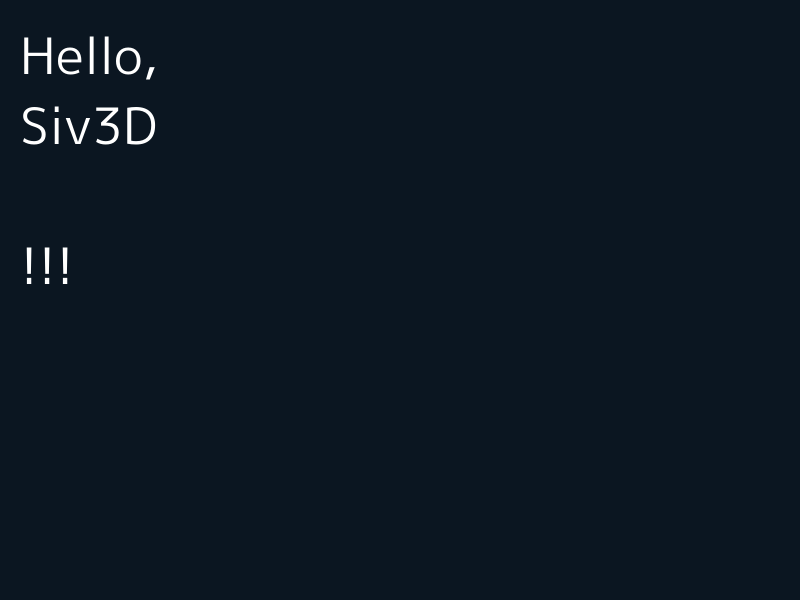
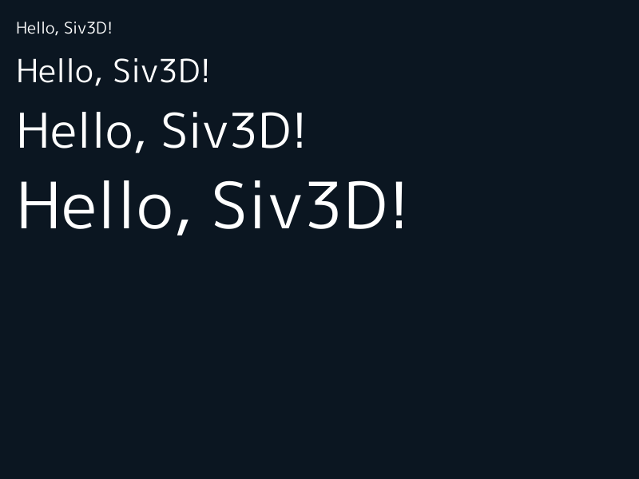
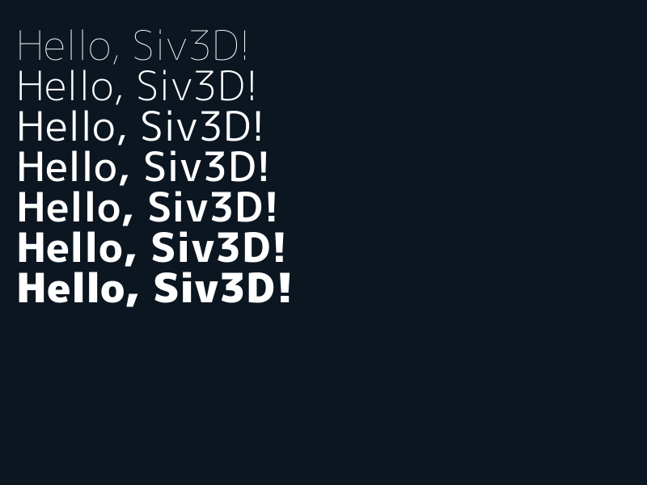
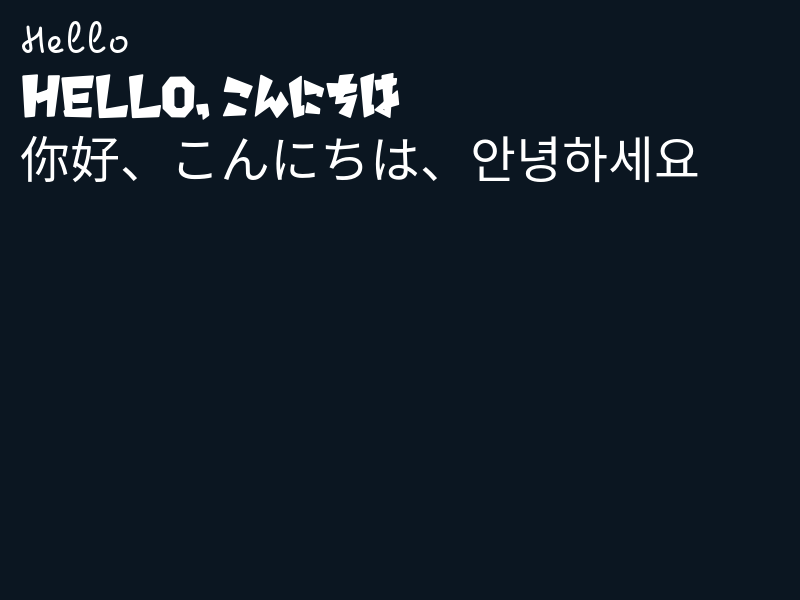
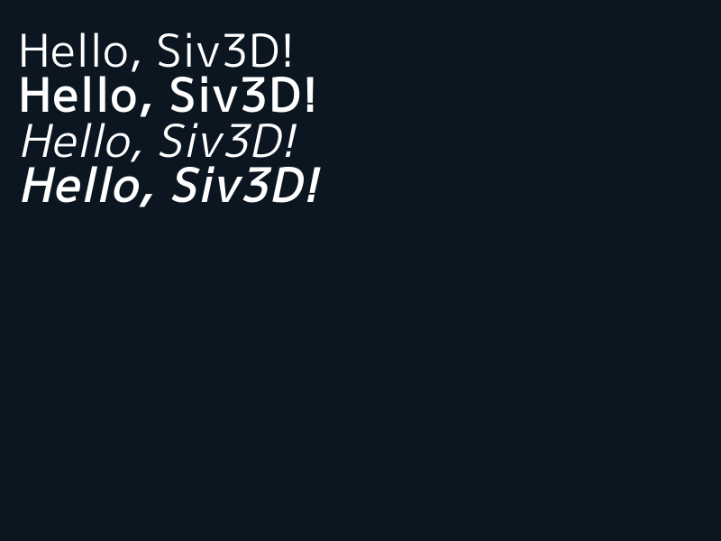
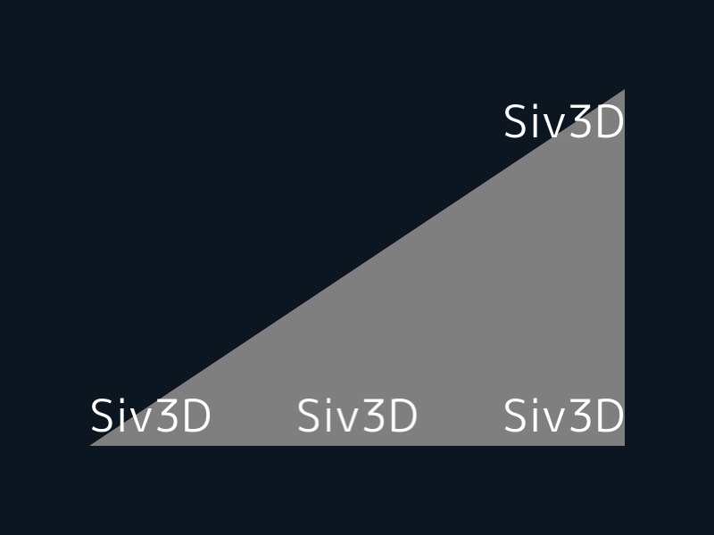
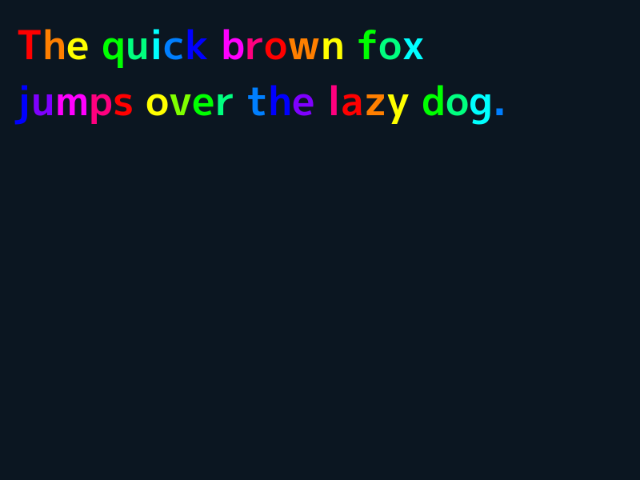
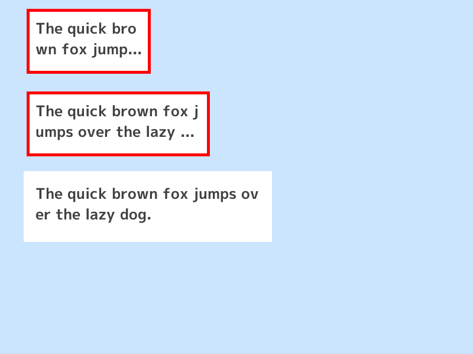

# 8. フォントを使う

この章では、フォントを使って様々なスタイルのテキストを描く方法を学びます。

## 8.1 Font
前章までテキストの表示に使ってきた `Print` は、フォントのサイズや種類、描画位置に自由度がありませんでした。自由にカスタマイズしたフォントを使ってテキストを描きたいときは `Font` を作成し、描画したい内容を `()` でつなげたあと、`.draw()` または `.drawAt()` します。

`Texture` と同じように、`Font` の作成にはメモリ確保などの実行時負荷がかかります。メインループの中で毎フレーム新しい `Font` を作成するのは避け、作成が 1 回だけで済むようにしましょう。


```C++
# include <Siv3D.hpp>

void Main()
{
	// サイズ 50 のフォントを作成
	const Font font(50);

	while (System::Update())
	{
		// 左上位置 (20, 20) からテキストを描く
		font(U"Hello, Siv3D!").draw(20, 20);

		// テキストの中心座標が画面の中心になるようにテキストを描く
		font(U"C++").drawAt(Scene::Center(), Palette::Skyblue);

        // 文字列以外を渡すと Format される
		font(Cursor::Pos()).draw(50, 300);

        // 複数渡すと、Format でつなげられる
		font(123, U"ABC").draw(50, 400);

		font(U"{}/{}/{}"_fmt(2020, 12, 31)).draw(50, 500);
	}
}
```


## 8.2 改行する
テキストの中に改行文字 `\n` が含まれていると、そこで改行されます。



```C++
# include <Siv3D.hpp>

void Main()
{
	const Font font(50);

	while (System::Update())
	{
		font(U"Hello,\nSiv3D\n\n!!!").draw(20, 20);
	}
}
```


## 8.3 フォントのサイズ
`Font` のコンストラクタの第一引数にはフォントのサイズを指定します。単位はピクセルです。



```C++
# include <Siv3D.hpp>

void Main()
{
	// 大きさ 20 のフォント
	const Font font20(20);

	// 大きさ 40 のフォント
	const Font font40(40);

	// 大きさ 60 のフォント
	const Font font60(60);

	// 大きさ 80 のフォント
	const Font font80(80);

	const String text = U"Hello, Siv3D!";

	while (System::Update())
	{
		font20(text).draw(20, 20);

		font40(text).draw(20, 60);

		font60(text).draw(20, 120);

		font80(text).draw(20, 200);
	}
}
```


## 8.4 フォントの種類
Siv3D には異なる太さの 7 種類の書体が同梱されています。`Font` のコンストラクタの第二引数において `Typeface::` で太さを指定することで、それらの書体を利用できます。何も指定しなかった場合 `Typeface::Regular` が選択されます。

!!! info
    Siv3D には「M+ 1p」という書体の 7 種類のウエイトのフォントファイルが同梱されています。



```C++
# include <Siv3D.hpp>

void Main()
{
	// 細いフォント
	const Font fontThin(50, Typeface::Thin);

	// やや細いフォント
	const Font fontLight(50, Typeface::Light);

	// 通常のフォント（デフォルト）
	const Font fontRegular(50, Typeface::Regular);

	// やや太いフォント
	const Font fontMedium(50, Typeface::Medium);

	// 太いフォント
	const Font fontBold(50, Typeface::Bold);

	// とても太いフォント
	const Font fontHeavy(50, Typeface::Heavy);

	// 非常に太いフォント
	const Font fontBlack(50, Typeface::Black);

	const String text = U"Hello, Siv3D!";

	while (System::Update())
	{
		fontThin(text).draw(20, 20);
		fontLight(text).draw(20, 70);
		fontRegular(text).draw(20, 120);
		fontMedium(text).draw(20, 170);
		fontBold(text).draw(20, 220);
		fontHeavy(text).draw(20, 270);
		fontBlack(text).draw(20, 320);
	}
}
```


## 8.5 フォントファイルからフォントを読み込んで使う
PC 上にあるフォントファイルから `Font` を作成するには、`Font` のコンストラクタの第二引数に、読み込みたいフォントファイルのパスを渡します。このファイルパスは、実行ファイルがあるフォルダ（開発中は App フォルダ）を基準とする相対パスか、絶対パスを使用します。リリース用のアプリを作るときには、のちの章で説明する「リソース」パスの使用を推奨します。



```C++
# include <Siv3D.hpp>

void Main()
{
	// Pecita.otf をロードして使う
	const Font font1(50, U"example/font/Pecita/Pecita.otf");

	// AnnyantRoman.ttf をロードして使う
	const Font font2(50, U"example/font/AnnyantRoman/AnnyantRoman.ttf");

	// NotoSansCJKjp-Regular.otf をロードして使う
	const Font font3(50, U"example/font/NotoSansCJKjp/NotoSansCJKjp-Regular.otf");

	while (System::Update())
	{
		font1(U"Hello").draw(20, 20);

		font2(U"Hello, こんにちは").draw(20, 70);

		font3(U"你好、こんにちは、안녕하세요").draw(20, 120);
	}
}
```


## 8.6 PC にインストールされているフォントを使う
PC にインストールされているフォントは OS ごとに特殊なフォルダに保存されています。そのフォルダのパスを `FileSystem::SpecialFolderPath()` で取得し、フォントファイル名とつなげることで、ファイルパスを構築できます。`FileSystem::SpecialFolderPath()` に渡す `SpecialFolder` の種類と OS によって取得できるパスの対応表は次の通りです。macOS のみ 3 つの戻り値が異なります。

|                            | Windows             | macOS                  | Linux       |
|----------------------------|---------------------|------------------------|-------------|
| SpecialFolder::SystemFonts | (OS):/WINDOWS/Fonts/ | /System/Library/Fonts/ | (Documents) |
| SpecialFolder::LocalFonts  | (OS):/WINDOWS/Fonts/ | /Library/Fonts/        | (Documents) |
| SpecialFolder::UserFonts   | (OS):/WINDOWS/Fonts/ | ~/Library/Fonts/       | (Documents) |


```C++
# include <Siv3D.hpp>

void Main()
{
# if SIV3D_PLATFORM(WINDOWS)

	const Font font(60, FileSystem::SpecialFolderPath(SpecialFolder::SystemFonts) + U"arial.ttf");

# elif SIV3D_PLATFORM(MACOS)

	const Font font(60, FileSystem::SpecialFolderPath(SpecialFolder::SystemFonts) + U"Helvetica.dfont");

# endif

	while (System::Update())
	{
	# if SIV3D_PLATFORM(WINDOWS)

		font(U"Arial").draw(20, 40);

	# elif SIV3D_PLATFORM(MACOS)

		font(U"Helvetica").draw(20, 40);

	# endif
	}
}
```

!!! info
    `SIV3D_PLATFORM(WINDOWS)` や `SIV3D_PLATFORM(MACOS)` は Siv3D でプラットフォーム別のコードを書くときに使えるマクロです。


## 8.7 テキストが表示される領域を調べる
`Font` の `.draw()` や `.drawAt()` は、描画された領域を `Rect` または `RectF` 型で返します。また、`.region()` や `.regionAt()` を使うと、描画することなくその領域を取得できます。


```C++
# include <Siv3D.hpp>

void Main()
{
	const Font font(50);

	const String text = U"Hello, Siv3D!";

	constexpr Point pos(20, 20);

	// font を使って text を pos の位置に描画したときのテキストの領域を取得
	const Rect rect = font(text).region(pos);

	while (System::Update())
	{
		// 描画領域の長方形を事前に塗りつぶす
		rect.draw(Palette::Skyblue);

		// 長方形の上にテキストを描く
		font(text).draw(pos, ColorF(0.25));
	}
}
```


## 8.8 フォントのスタイルを変える
`Font` のコンストラクタの第三引数に `FontStyle` を指定することで、イタリックやボールドなどのスタイルをフォントに適用できます。



```C++
# include <Siv3D.hpp>

void Main()
{
	const Font font(50, Typeface::Default);

	// ボールド
	const Font fontBold(50, Typeface::Default, FontStyle::Bold);

	// イタリック
	const Font fontItalic(50, Typeface::Default, FontStyle::Italic);

	// ボールド・イタリック
	const Font fontBoldItalic(50, Typeface::Default, FontStyle::BoldItalic);

	const String text = U"Hello, Siv3D!";

	while (System::Update())
	{
		font(text).draw(20, 20);

		fontBold(text).draw(20, 70);

		fontItalic(text).draw(20, 120);

		fontBoldItalic(text).draw(20, 170);
	}
}
```


## 8.9 異なるフォントでベースラインをそろえる
文字のベースラインの開始位置を指定して描画したい場合は `.drawBase()` を使います。異なるサイズや種類のフォントを、ベースラインをそろえて描画できます。


```C++
# include <Siv3D.hpp>

void Main()
{
	const Font font20(20);

	const Font font40(40);

	const Font font60(60);

	const String text = U"Hello, Siv3D!";

	while (System::Update())
	{
		// ベースラインがそろわない
		font20(text).draw(20, 100);
		font40(text).draw(160, 100);
		font60(text).draw(420, 100);

		Rect(0, 400, 800, 200).draw(ColorF(0.4));

		// (20, 100) がベースラインの開始位置になるようテキストを描画
		font20(text).drawBase(20, 400);

		// (160, 100) がベースラインの開始位置になるようテキストを描画
		font40(text).drawBase(160, 400);

		// (420, 100) がベースラインの開始位置になるようテキストを描画
		font60(text).drawBase(420, 400);
	}
}
```


## 8.10 テキスト描画の基準位置をカスタマイズする
左上や中心以外にも、描画座標の基準点を設定できます。



```C++
# include <Siv3D.hpp>

void Main()
{
	const Font font(50);

	constexpr Vec2 pos1(700, 100);

	constexpr Vec2 pos2(700, 500);

	constexpr Vec2 pos3(100, 500);

	const String text = U"Siv3D";

	while (System::Update())
	{
		Triangle(pos1, pos2, pos3).draw(ColorF(0.5));

		// 右上の位置を基準
		font(text).draw(Arg::topRight = pos1);

		// 右下の位置を基準にする
		font(text).draw(Arg::bottomRight = pos2);

		// 左下の位置を基準にする
		font(text).draw(Arg::bottomLeft = pos3);

		// 底辺中央の位置を基準にする
		font(text).draw(Arg::bottomCenter(400, 500));
	}
}
```


## 8.11 文字に影の効果を付ける
座標をずらして 2回 テキストを描くと、影の効果を簡単に作成できます。`Vec2::movedBy(x, y)` を使うと、指定した値だけ要素を加算した `Vec2` を作成できます。


```C++
# include <Siv3D.hpp>

void Main()
{
	Scene::SetBackground(ColorF(0.7, 0.9, 0.8));

	const Font font(100, Typeface::Bold);

	constexpr Vec2 center(400, 150);

	const String text = U"Hello, Siv3D!";

	while (System::Update())
	{
		// center から (4, 4) ずらした位置を中心にテキストを描く
		font(text).drawAt(center.movedBy(4, 4), ColorF(0.0, 0.5));

		// center を中心にテキストを描く
		font(text).drawAt(center);
	}
}
```


## 8.12 文字単位で描画を制御する
`font(text)` を `for` ループで次のように使用すると、文字を自由に制御して描画するために必要な `Glyph` 型のオブジェクトを文字ごとに取得できます。`.codePoint` はその文字の UTF-32 コードポイントを、`.index` はテキスト内の文字の位置インデックスを、`.offset` はペンの位置からさらに必要なオフセットを、`.xAdvance` は次の文字への X 座標の距離を表します。



```C++
# include <Siv3D.hpp>

void Main()
{
	const Font font(50, Typeface::Bold);

	const String text = U"The quick brown fox\njumps over the lazy dog.";

	while (System::Update())
	{
		constexpr Vec2 basePos(20, 20);

		Vec2 penPos(basePos);

		// 文字単位で描画を制御するためのループ
		for (const auto& glyph : font(text))
		{
			// 改行文字なら
			if (glyph.codePoint == U'\n')
			{
				// ペンの X 座標をリセット
				penPos.x = basePos.x;

				// ペンの Y 座標をフォントの高さ分進める
				penPos.y += font.height();

				continue;
			}

			// 何文字目かに応じて色を変える
			const ColorF color = HSV(glyph.index * 30);

			// 文字のテクスチャをペンの位置に文字ごとのオフセットを加算して描画
			glyph.texture.draw(penPos + glyph.offset, color);

			// ペンの X 座標を文字の幅の分進める
			penPos.x += glyph.xAdvance;
		}
	}
}
```


## 8.13 縦書きでテキストを描画する
`Font::getVerticalGlyphs()` で縦書き用のグリフを取得できるので、それを使うってテキストの縦書きを実現できます。


```C++
# include <Siv3D.hpp>

void Main()
{
	Scene::SetBackground(ColorF(0.8, 0.9, 1.0));
	
	const Font font(50, Typeface::Bold);

	while (System::Update())
	{
		font(U"「横書き」\nフィーチャー。（！）").draw(40, 40, ColorF(0.25));

		const Vec2 basePos(650, 40);
		
		Vec2 penPos(basePos);

		// 縦書き用の字形を使って文字を描画
		for (const auto& glyph : font.getVerticalGlyphs(U"「縦書き」\nフィーチャー。（！）"))
		{
			if (glyph.codePoint == U'\n')
			{
				penPos.x -= font.height();
				penPos.y = basePos.y;
				continue;
			}

			glyph.texture.draw(penPos + glyph.offset, ColorF(0.25));
			penPos.y += glyph.yAdvance;
		}
	}
}
```

## 8.14 指定した長方形の中にテキストを描く
`Font::draw()` に `Rect` または `RectF` を渡すと、テキストをその長方形の内部に収まるように描画します。文字があふれる場合、最後の文字が `…` に置き換えられ、関数は `false` を返します。



```C++
# include <Siv3D.hpp>

void Main()
{
	Scene::SetBackground(ColorF(0.8, 0.9, 1.0));
	
	const Font font(25, Typeface::Bold);
	const String text = U"The quick brown fox jumps over the lazy dog.";

	constexpr Rect rect1(50, 20, 200, 100);
	constexpr Rect rect2(50, 160, 300, 100);
	constexpr Rect rect3(50, 300, 400, 100);

	while (System::Update())
	{
		rect1.draw();
		bool full = font(text).draw(rect1.stretched(-10), ColorF(0.25));
		if (!full)
		{
			// 文字が省略されたら赤枠
			rect1.drawFrame(0, 5, Palette::Red);
		}

		rect2.draw();
		full = font(text).draw(rect2.stretched(-10), ColorF(0.25));
		if (!full)
		{
			// 文字が省略されたら赤枠
			rect2.drawFrame(0, 5, Palette::Red);
		}

		rect3.stretched(10).draw();
		full = font(text).draw(rect3.stretched(-10), ColorF(0.25));
		if (!full)
		{
			// 文字が省略されたら赤枠
			rect3.drawFrame(0, 5, Palette::Red);
		}
	}
}
```

## 8.15 テキストを 1 文字ずつ表示する
`String::substr(0, N)` で、0 文字目から N 文字分の文字列を取得できます。N を時間に応じて増やすことで 1 文字ずつテキストを表示できます。N が文字列の長さよりも大きくなっても、その分は単に無視されます。 


```C++
# include <Siv3D.hpp>

void Main()
{
	const Font font(30, Typeface::Bold);

	const String text = U"The quick brown fox\njumps over the lazy dog.";

	while (System::Update())
	{
		// 文字カウントを 0.1 秒ごとに増やす
		const size_t length = static_cast<size_t>(Scene::Time() / 0.1);

		// text の文字数以上の length は切り捨てられる
		font(text.substr(0, length)).draw(50, 50);
	}
}
```

## 8.16 フォントあれこれ

### フォントのサイズの動的な変更
フォントのサイズを動的に変更することはできません。のちの章で登場する `Transformer2D` を使って描画スケールを拡大縮小した状態でフォントを描画することで、見た目の大きさを変更できます。

### フォントの最大サイズ
フォントの最大サイズは `Font::MaxSize` で定義されている `256` です。

### フォントの作成チェック
`if (font)` で、フォントが作成されているかどうかをチェックできます。

```C++
# include <Siv3D.hpp>

void Main()
{
	// 存在しないフォントファイルを使おうとする
	const Font font(60, U"aaa/bbb.ttf");

	// フォントの作成ができていなかったら
	if (!font)
	{
		// 例外を投げて終了
		throw Error(U"Failed to create Font");
	}

	while (System::Update())
	{

	}
}
```

### 空のフォント
作成に失敗したフォントを使っても何も表示されません。

```C++
# include <Siv3D.hpp>

void Main()
{
	const Font font(60, U"aaa/bbb.ttf");

	while (System::Update())
	{
		// 何も表示されない
		font(U"Hello, Siv3D").draw(20, 20);
	}
}
```


