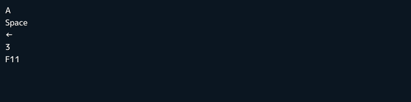
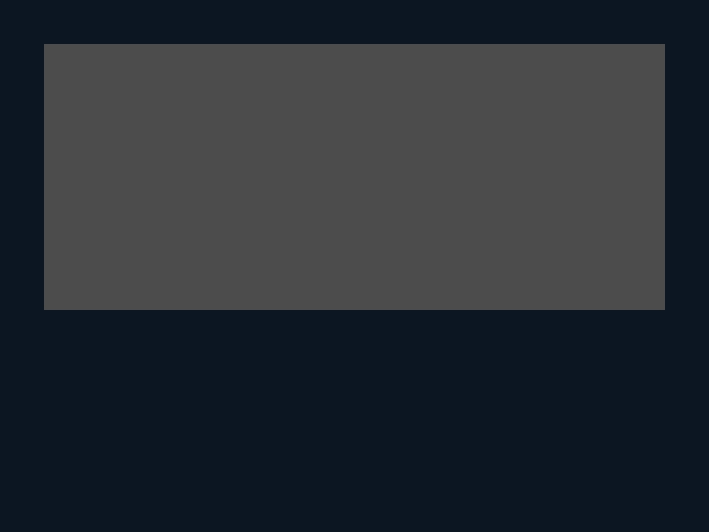

# 11. キーボード入力

この章では、キーボードの入力を処理する方法を学びます。

## 11.1 キーの入力状態
キーボードのキーには `Key` 型のオブジェクトが割り当てられています。

- A, B, C, ... は `KeyA`, `KeyB`, `KeyC` , ...
- 1, 2, 3, ... は `Key1`, `Key2`, `Key3`, ...
- F1, F2, F3, ... は `KeyF1`, `KeyF2`, `KeyF3`, ...
- ↑, ↓, ←, → は `KeyUp`, `KeyDown`, `KeyLeft`, `KeyRight`
- スペースキーは `KeySpace`
- エンターキーは `KeyEnter`
- バックスペースキーは `KeyBackspace`
- Tab キーは `KeyTab`
- Esc キーは `KeyEscape`
- PageUp, PageDown は `KeyPageUp`, `KeyPageDown`
- Delete キーは `KeyDelete`
- Numpad の 0, 1, 2, ... は `KeyNum0`, `KeyNum1`, `KeyNum2`, ...
- シフトキーは `KeyShift`
- 左シフトキー、右シフトキーは `KeyLShift`, `KeyRShift`
- コントロールキーは `KeyControl`
- (macOS) コマンドキーは `KeyCommand`
- 「,」「.」「/」キーは `KeyComma`, `KeyPeriod`, `KeySlash`
- 上記以外のキーは `<Siv3D/Keyboard.hpp>` を参照

押された瞬間であるかを `.down()`, 押されているかを `.pressed()`, 離された瞬間であるかを `.up()` を使って `bool` 値で取得できます。

|          | down | pressed | up |
|----------|------|---------|----|
| 押していない   |      |         |    |
| 押した瞬間    | ✔    | ✔       |    |
| 押され続けている |      | ✔       |    |
| 離した瞬間    |      |         | ✔  |
| 離され続けている |      |         |    |


```C++
# include <Siv3D.hpp>

void Main()
{
	Vec2 pos = Scene::Center();

	while (System::Update())
	{
		const double delta = 200 * Scene::DeltaTime();

		// 上下左右キーで移動
		if (KeyLeft.pressed())
		{
			pos.x -= delta;
		}

		if (KeyRight.pressed())
		{
			pos.x += delta;
		}

		if (KeyUp.pressed())
		{
			pos.y -= delta;
		}

		if (KeyDown.pressed())
		{
			pos.y += delta;
		}

		// [C] キーが押されたら中央に戻る
		if (KeyC.down())
		{
			pos = Scene::Center();
		}

		Circle(pos, 50).draw();
	}
}
```


## 11.2 キーが押されている時間
`Key::pressedDuration()` は、そのキーが押され続けている時間を `Duration` 型の値で返します。


```C++
# include <Siv3D.hpp>

void Main()
{
	while (System::Update())
	{
		ClearPrint();
		Print << KeyA.pressedDuration();
	}
}
```


## 11.3 キーの名前
`Key::name()` は、そのキーの名前を `String` 型の値で返します。



```C++
# include <Siv3D.hpp>

void Main()
{
	Print << KeyA.name();
	Print << KeySpace.name();
	Print << KeyLeft.name();
	Print << Key3.name();
	Print << KeyF11.name();

	while (System::Update())
	{

	}
}
```


## 11.4 複数のキーの組み合わせ

### A または B
`|` を使って複数のキーを組み合わせると、そのいずれかが押されているかどうかを判定できます。
```C++
# include <Siv3D.hpp>

void Main()
{
	while (System::Update())
	{
		ClearPrint();

		if ((KeySpace | KeyEnter).pressed())
		{
			Print << U"KeySpace / KeyEnter";
		}
	}
}
```

### A を押しながら B
`+` を使って 2 つのキーを組み合わせると、左のキーが押されながら、右のキーが押されたかどうかを判定できます。
```C++
# include <Siv3D.hpp>

void Main()
{
	while (System::Update())
	{
		if ((KeyControl + KeyC).down() || (KeyCommand + KeyC).down())
		{
			Print << U"Ctrl + C / Command + C";
		}
	}
}
```


## 11.5 テキスト入力
`TextInput::UpdateText()` に `String` 型の変数を渡すことで、テキスト入力を処理できます。



```C++
# include <Siv3D.hpp>

void Main()
{
	const Font font(30);

	String text;

	const Rect area(50, 50, 700, 300);

	while (System::Update())
	{
		// キーボードからテキストを入力
		TextInput::UpdateText(text);

		area.draw(ColorF(0.3));

		font(text).draw(area.stretched(-20));
	}
}
```


