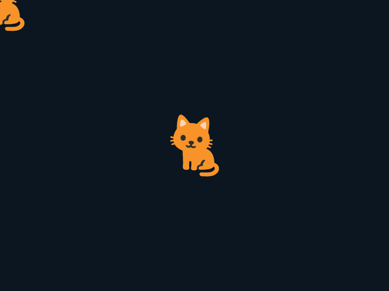
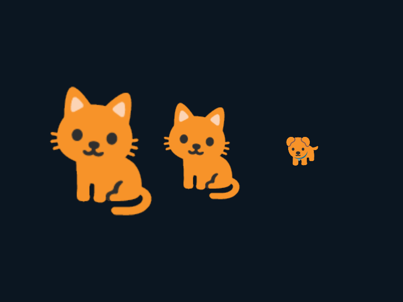
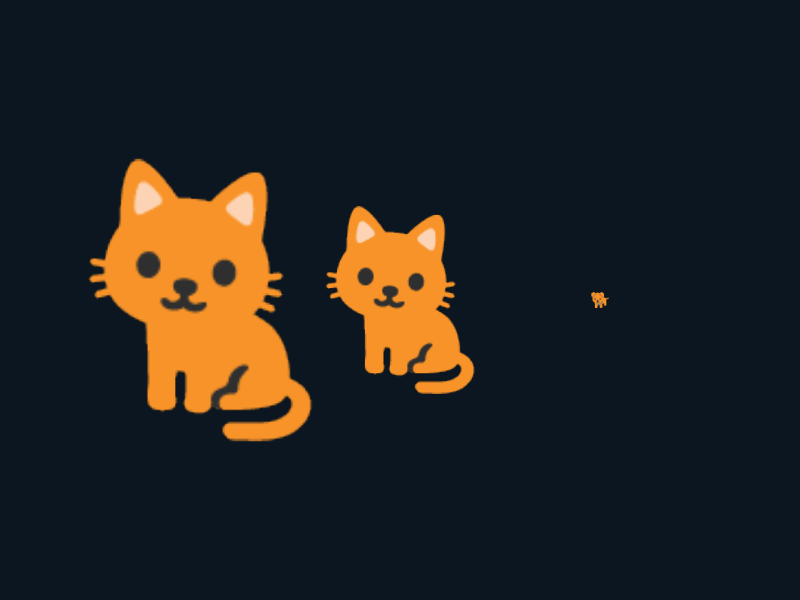
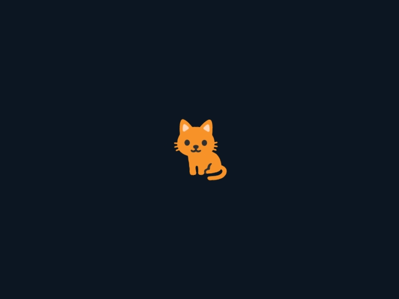
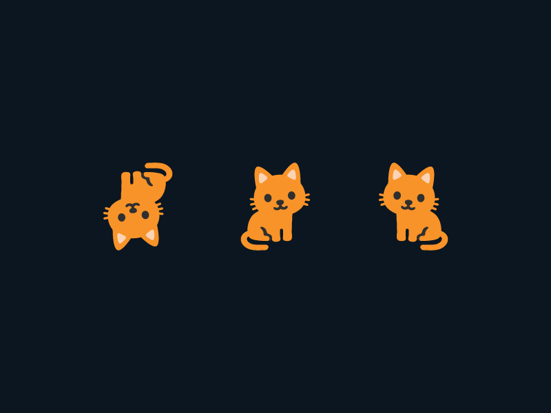
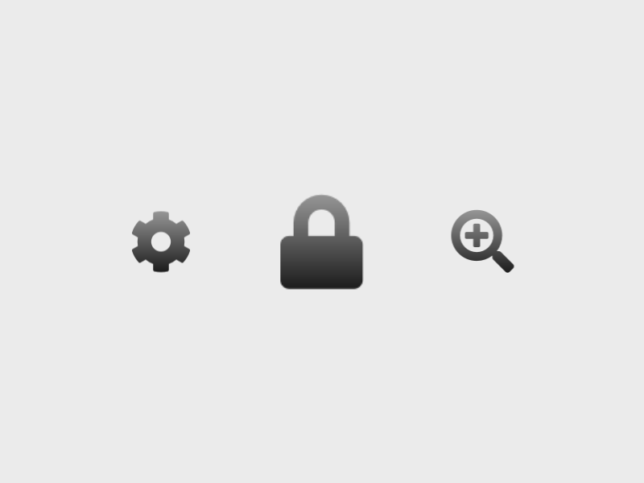

# 5. 画像を描く

この章では、絵文字やアイコン、画像データを画面に描く方法を学びます。

## 5.1 絵文字を描画する
画面に画像を描きたいときは `Texture` を作成し、`.draw()` または `drawAt` します。`Texture` は画像ファイルから画像データを読み込んで作成したり、プログラムで作成した画像データから作成したり、Siv3D が標準で提供している絵文字やアイコンコレクションから作成することができます。まずは絵文字コレクションから好きな絵文字を選んで `Texture` を作成し、描画するプログラムを書いてみましょう。

`Texture` の作成にはメモリ確保などの実行時負荷がかかります。メインループの中で毎フレーム新しい `Texture` を作成するのは避け、メインループの前で 1 回だけ作成するようにしましょう。絵文字コレクションから `Texture` を作成するには、`Texture` のコンストラクタ引数に `Emoji()` を渡します。

### Texture::drawAt()
`.drawAt()` では、テクスチャの中心をどこに据えるかを画面の座標で指定します。絵文字やアイコンを描く場合はこちらが便利です。



```C++
# include <Siv3D.hpp>

void Main()
{
    Scene::Setback

	// 🐈 の絵文字からテクスチャを作成
	const Texture texture(Emoji(U"🐈"));

	while (System::Update())
	{
		// テクスチャを座標 (0, 0) を中心に描画
		texture.drawAt(0, 0);

		// テクスチャを画面中央を中心に描画
		texture.drawAt(Scene::Center());
	}
}
```

### Texture::draw()
`.draw()` では、テクスチャの左上をどこに据えるかを画面の座標で指定します。背景画像や UI などを描くときにはこちらが便利な場合があります。サンプル画像では、わかりやすいように座標を赤丸で表示し、テクスチャの境界線を白線で表示しています。


```C++
# include <Siv3D.hpp>

void Main()
{
	// 🐈 の絵文字からテクスチャを作成
	const Texture texture(Emoji(U"🐈"));

	while (System::Update())
	{
		// テクスチャを座標 (0, 0) から描画
		texture.draw(0, 0);

		// テクスチャを画面中心から描画
		texture.draw(Scene::Center());
	}
}
```

### Siv3D で使える絵文字の一覧
OpenSiv3D で使える絵文字は約 2,200 種類あります。

#### 感情・人
😀 😁 😂 🤣 😃 😄 😅 😆 😉 😊 😋 😎 😍 😘 😗 😙 😚 ☺ 🙂 🤗 🤔 😐 😑 😶 🙄 😏 😣 😥 😮 🤐 😯 😪 😫 😴 😌 🤓 😛 😜 😝 🤤 😒 😓 😔 😕 🙃 🤑 😲 ☹ 🙁 😖 😞 😟 😤 😢 😭 😦 😧 😨 😩 😬 😰 😱 😳 😵 😡 😠 😇 🤠 🤡 🤥 😷 🤒 🤕 🤢 🤧 😈 👿 👹 👺 💀 ☠ 👻 👽 👾 🤖 💩 😺 😸 😹 😻 😼 😽 🙀 😿 😾 🙈 🙉 🙊 👦 👦🏻 👦🏼 👦🏽 👦🏾 👦🏿 👧 👧🏻 👧🏼 👧🏽 👧🏾 👧🏿 👨 👨🏻 👨🏼 👨🏽 👨🏾 👨🏿 👩 👩🏻 👩🏼 👩🏽 👩🏾 👩🏿 👴 👴🏻 👴🏼 👴🏽 👴🏾 👴🏿 👵 👵🏻 👵🏼 👵🏽 👵🏾 👵🏿 👶 👶🏻 👶🏼 👶🏽 👶🏾 👶🏿 👼 👼🏻 👼🏼 👼🏽 👼🏾 👼🏿 👨‍⚕ 👨🏻‍⚕ 👨🏼‍⚕ 👨🏽‍⚕ 👨🏾‍⚕ 👨🏿‍⚕ 👩‍⚕ 👩🏻‍⚕ 👩🏼‍⚕ 👩🏽‍⚕ 👩🏾‍⚕ 👩🏿‍⚕ 👨‍🎓 👨🏻‍🎓 👨🏼‍🎓 👨🏽‍🎓 👨🏾‍🎓 👨🏿‍🎓 👩‍🎓 👩🏻‍🎓 👩🏼‍🎓 👩🏽‍🎓 👩🏾‍🎓 👩🏿‍🎓 👨‍🏫 👨🏻‍🏫 👨🏼‍🏫 👨🏽‍🏫 👨🏾‍🏫 👨🏿‍🏫 👩‍🏫 👩🏻‍🏫 👩🏼‍🏫 👩🏽‍🏫 👩🏾‍🏫 👩🏿‍🏫 👨‍⚖ 👨🏻‍⚖ 👨🏼‍⚖ 👨🏽‍⚖ 👨🏾‍⚖ 👨🏿‍⚖ 👩‍⚖ 👩🏻‍⚖ 👩🏼‍⚖ 👩🏽‍⚖ 👩🏾‍⚖ 👩🏿‍⚖ 👨‍🌾 👨🏻‍🌾 👨🏼‍🌾 👨🏽‍🌾 👨🏾‍🌾 👨🏿‍🌾 👩‍🌾 👩🏻‍🌾 👩🏼‍🌾 👩🏽‍🌾 👩🏾‍🌾 👩🏿‍🌾 👨‍🍳 👨🏻‍🍳 👨🏼‍🍳 👨🏽‍🍳 👨🏾‍🍳 👨🏿‍🍳 👩‍🍳 👩🏻‍🍳 👩🏼‍🍳 👩🏽‍🍳 👩🏾‍🍳 👩🏿‍🍳 👨‍🔧 👨🏻‍🔧 👨🏼‍🔧 👨🏽‍🔧 👨🏾‍🔧 👨🏿‍🔧 👩‍🔧 👩🏻‍🔧 👩🏼‍🔧 👩🏽‍🔧 👩🏾‍🔧 👩🏿‍🔧 👨‍🏭 👨🏻‍🏭 👨🏼‍🏭 👨🏽‍🏭 👨🏾‍🏭 👨🏿‍🏭 👩‍🏭 👩🏻‍🏭 👩🏼‍🏭 👩🏽‍🏭 👩🏾‍🏭 👩🏿‍🏭 👨‍💼 👨🏻‍💼 👨🏼‍💼 👨🏽‍💼 👨🏾‍💼 👨🏿‍💼 👩‍💼 👩🏻‍💼 👩🏼‍💼 👩🏽‍💼 👩🏾‍💼 👩🏿‍💼 👨‍🔬 👨🏻‍🔬 👨🏼‍🔬 👨🏽‍🔬 👨🏾‍🔬 👨🏿‍🔬 👩‍🔬 👩🏻‍🔬 👩🏼‍🔬 👩🏽‍🔬 👩🏾‍🔬 👩🏿‍🔬 👨‍💻 👨🏻‍💻 👨🏼‍💻 👨🏽‍💻 👨🏾‍💻 👨🏿‍💻 👩‍💻 👩🏻‍💻 👩🏼‍💻 👩🏽‍💻 👩🏾‍💻 👩🏿‍💻 👨‍🎤 👨🏻‍🎤 👨🏼‍🎤 👨🏽‍🎤 👨🏾‍🎤 👨🏿‍🎤 👩‍🎤 👩🏻‍🎤 👩🏼‍🎤 👩🏽‍🎤 👩🏾‍🎤 👩🏿‍🎤 👨‍🎨 👨🏻‍🎨 👨🏼‍🎨 👨🏽‍🎨 👨🏾‍🎨 👨🏿‍🎨 👩‍🎨 👩🏻‍🎨 👩🏼‍🎨 👩🏽‍🎨 👩🏾‍🎨 👩🏿‍🎨 👨‍✈ 👨🏻‍✈ 👨🏼‍✈ 👨🏽‍✈ 👨🏾‍✈ 👨🏿‍✈ 👩‍✈ 👩🏻‍✈ 👩🏼‍✈ 👩🏽‍✈ 👩🏾‍✈ 👩🏿‍✈ 👨‍🚀 👨🏻‍🚀 👨🏼‍🚀 👨🏽‍🚀 👨🏾‍🚀 👨🏿‍🚀 👩‍🚀 👩🏻‍🚀 👩🏼‍🚀 👩🏽‍🚀 👩🏾‍🚀 👩🏿‍🚀 👨‍🚒 👨🏻‍🚒 👨🏼‍🚒 👨🏽‍🚒 👨🏾‍🚒 👨🏿‍🚒 👩‍🚒 👩🏻‍🚒 👩🏼‍🚒 👩🏽‍🚒 👩🏾‍🚒 👩🏿‍🚒 👮‍♂ 👮🏻‍♂ 👮🏼‍♂ 👮🏽‍♂ 👮🏾‍♂ 👮🏿‍♂ 👮‍♀ 👮🏻‍♀ 👮🏼‍♀ 👮🏽‍♀ 👮🏾‍♀ 👮🏿‍♀ 🕵‍♂ 🕵🏻‍♂ 🕵🏼‍♂ 🕵🏽‍♂ 🕵🏾‍♂ 🕵🏿‍♂ 🕵‍♀ 🕵🏻‍♀ 🕵🏼‍♀ 🕵🏽‍♀ 🕵🏾‍♀ 🕵🏿‍♀ 💂‍♂ 💂🏻‍♂ 💂🏼‍♂ 💂🏽‍♂ 💂🏾‍♂ 💂🏿‍♂ 💂‍♀ 💂🏻‍♀ 💂🏼‍♀ 💂🏽‍♀ 💂🏾‍♀ 💂🏿‍♀ 👷‍♂ 👷🏻‍♂ 👷🏼‍♂ 👷🏽‍♂ 👷🏾‍♂ 👷🏿‍♂ 👷‍♀ 👷🏻‍♀ 👷🏼‍♀ 👷🏽‍♀ 👷🏾‍♀ 👷🏿‍♀ 👳‍♂ 👳🏻‍♂ 👳🏼‍♂ 👳🏽‍♂ 👳🏾‍♂ 👳🏿‍♂ 👳‍♀ 👳🏻‍♀ 👳🏼‍♀ 👳🏽‍♀ 👳🏾‍♀ 👳🏿‍♀ 👱‍♂ 👱🏻‍♂ 👱🏼‍♂ 👱🏽‍♂ 👱🏾‍♂ 👱🏿‍♂ 👱‍♀ 👱🏻‍♀ 👱🏼‍♀ 👱🏽‍♀ 👱🏾‍♀ 👱🏿‍♀ 🎅 🎅🏻 🎅🏼 🎅🏽 🎅🏾 🎅🏿 🤶 🤶🏻 🤶🏼 🤶🏽 🤶🏾 🤶🏿 👸 👸🏻 👸🏼 👸🏽 👸🏾 👸🏿 🤴 🤴🏻 🤴🏼 🤴🏽 🤴🏾 🤴🏿 👰 👰🏻 👰🏼 👰🏽 👰🏾 👰🏿 🤵 🤵🏻 🤵🏼 🤵🏽 🤵🏾 🤵🏿 🤰 🤰🏻 🤰🏼 🤰🏽 🤰🏾 🤰🏿 👲 👲🏻 👲🏼 👲🏽 👲🏾 👲🏿 🙍‍♂ 🙍🏻‍♂ 🙍🏼‍♂ 🙍🏽‍♂ 🙍🏾‍♂ 🙍🏿‍♂ 🙍‍♀ 🙍🏻‍♀ 🙍🏼‍♀ 🙍🏽‍♀ 🙍🏾‍♀ 🙍🏿‍♀ 🙎‍♂ 🙎🏻‍♂ 🙎🏼‍♂ 🙎🏽‍♂ 🙎🏾‍♂ 🙎🏿‍♂ 🙎‍♀ 🙎🏻‍♀ 🙎🏼‍♀ 🙎🏽‍♀ 🙎🏾‍♀ 🙎🏿‍♀ 🙅‍♂ 🙅🏻‍♂ 🙅🏼‍♂ 🙅🏽‍♂ 🙅🏾‍♂ 🙅🏿‍♂ 🙅‍♀ 🙅🏻‍♀ 🙅🏼‍♀ 🙅🏽‍♀ 🙅🏾‍♀ 🙅🏿‍♀ 🙆‍♂ 🙆🏻‍♂ 🙆🏼‍♂ 🙆🏽‍♂ 🙆🏾‍♂ 🙆🏿‍♂ 🙆‍♀ 🙆🏻‍♀ 🙆🏼‍♀ 🙆🏽‍♀ 🙆🏾‍♀ 🙆🏿‍♀ 💁‍♂ 💁🏻‍♂ 💁🏼‍♂ 💁🏽‍♂ 💁🏾‍♂ 💁🏿‍♂ 💁‍♀ 💁🏻‍♀ 💁🏼‍♀ 💁🏽‍♀ 💁🏾‍♀ 💁🏿‍♀ 🙋‍♂ 🙋🏻‍♂ 🙋🏼‍♂ 🙋🏽‍♂ 🙋🏾‍♂ 🙋🏿‍♂ 🙋‍♀ 🙋🏻‍♀ 🙋🏼‍♀ 🙋🏽‍♀ 🙋🏾‍♀ 🙋🏿‍♀ 🙇‍♂ 🙇🏻‍♂ 🙇🏼‍♂ 🙇🏽‍♂ 🙇🏾‍♂ 🙇🏿‍♂ 🙇‍♀ 🙇🏻‍♀ 🙇🏼‍♀ 🙇🏽‍♀ 🙇🏾‍♀ 🙇🏿‍♀ 🤦‍♂ 🤦🏻‍♂ 🤦🏼‍♂ 🤦🏽‍♂ 🤦🏾‍♂ 🤦🏿‍♂ 🤦‍♀ 🤦🏻‍♀ 🤦🏼‍♀ 🤦🏽‍♀ 🤦🏾‍♀ 🤦🏿‍♀ 🤷‍♂ 🤷🏻‍♂ 🤷🏼‍♂ 🤷🏽‍♂ 🤷🏾‍♂ 🤷🏿‍♂ 🤷‍♀ 🤷🏻‍♀ 🤷🏼‍♀ 🤷🏽‍♀ 🤷🏾‍♀ 🤷🏿‍♀ 💆‍♂ 💆🏻‍♂ 💆🏼‍♂ 💆🏽‍♂ 💆🏾‍♂ 💆🏿‍♂ 💆‍♀ 💆🏻‍♀ 💆🏼‍♀ 💆🏽‍♀ 💆🏾‍♀ 💆🏿‍♀ 💇‍♂ 💇🏻‍♂ 💇🏼‍♂ 💇🏽‍♂ 💇🏾‍♂ 💇🏿‍♂ 💇‍♀ 💇🏻‍♀ 💇🏼‍♀ 💇🏽‍♀ 💇🏾‍♀ 💇🏿‍♀ 🚶‍♂ 🚶🏻‍♂ 🚶🏼‍♂ 🚶🏽‍♂ 🚶🏾‍♂ 🚶🏿‍♂ 🚶‍♀ 🚶🏻‍♀ 🚶🏼‍♀ 🚶🏽‍♀ 🚶🏾‍♀ 🚶🏿‍♀ 🏃‍♂ 🏃🏻‍♂ 🏃🏼‍♂ 🏃🏽‍♂ 🏃🏾‍♂ 🏃🏿‍♂ 🏃‍♀ 🏃🏻‍♀ 🏃🏼‍♀ 🏃🏽‍♀ 🏃🏾‍♀ 🏃🏿‍♀ 💃 💃🏻 💃🏼 💃🏽 💃🏾 💃🏿 🕺 🕺🏻 🕺🏼 🕺🏽 🕺🏾 🕺🏿 👯‍♂ 👯‍♀ 🕴 🗣 👤 👥 🤺 🏇 ⛷ 🏂 🏌‍♂ 🏌‍♀ 🏄‍♂ 🏄🏻‍♂ 🏄🏼‍♂ 🏄🏽‍♂ 🏄🏾‍♂ 🏄🏿‍♂ 🏄‍♀ 🏄🏻‍♀ 🏄🏼‍♀ 🏄🏽‍♀ 🏄🏾‍♀ 🏄🏿‍♀ 🚣‍♂ 🚣🏻‍♂ 🚣🏼‍♂ 🚣🏽‍♂ 🚣🏾‍♂ 🚣🏿‍♂ 🚣‍♀ 🚣🏻‍♀ 🚣🏼‍♀ 🚣🏽‍♀ 🚣🏾‍♀ 🚣🏿‍♀ 🏊‍♂ 🏊🏻‍♂ 🏊🏼‍♂ 🏊🏽‍♂ 🏊🏾‍♂ 🏊🏿‍♂ 🏊‍♀ 🏊🏻‍♀ 🏊🏼‍♀ 🏊🏽‍♀ 🏊🏾‍♀ 🏊🏿‍♀ ⛹‍♂ ⛹🏻‍♂ ⛹🏼‍♂ ⛹🏽‍♂ ⛹🏾‍♂ ⛹🏿‍♂ ⛹‍♀ ⛹🏻‍♀ ⛹🏼‍♀ ⛹🏽‍♀ ⛹🏾‍♀ ⛹🏿‍♀ 🏋‍♂ 🏋🏻‍♂ 🏋🏼‍♂ 🏋🏽‍♂ 🏋🏾‍♂ 🏋🏿‍♂ 🏋‍♀ 🏋🏻‍♀ 🏋🏼‍♀ 🏋🏽‍♀ 🏋🏾‍♀ 🏋🏿‍♀ 🚴‍♂ 🚴🏻‍♂ 🚴🏼‍♂ 🚴🏽‍♂ 🚴🏾‍♂ 🚴🏿‍♂ 🚴‍♀ 🚴🏻‍♀ 🚴🏼‍♀ 🚴🏽‍♀ 🚴🏾‍♀ 🚴🏿‍♀ 🚵‍♂ 🚵🏻‍♂ 🚵🏼‍♂ 🚵🏽‍♂ 🚵🏾‍♂ 🚵🏿‍♂ 🚵‍♀ 🚵🏻‍♀ 🚵🏼‍♀ 🚵🏽‍♀ 🚵🏾‍♀ 🚵🏿‍♀ 🏎 🏍 🤸‍♂ 🤸🏻‍♂ 🤸🏼‍♂ 🤸🏽‍♂ 🤸🏾‍♂ 🤸🏿‍♂ 🤸‍♀ 🤸🏻‍♀ 🤸🏼‍♀ 🤸🏽‍♀ 🤸🏾‍♀ 🤸🏿‍♀ 🤼‍♂ 🤼‍♀ 🤽‍♂ 🤽🏻‍♂ 🤽🏼‍♂ 🤽🏽‍♂ 🤽🏾‍♂ 🤽🏿‍♂ 🤽‍♀ 🤽🏻‍♀ 🤽🏼‍♀ 🤽🏽‍♀ 🤽🏾‍♀ 🤽🏿‍♀ 🤾‍♂ 🤾🏻‍♂ 🤾🏼‍♂ 🤾🏽‍♂ 🤾🏾‍♂ 🤾🏿‍♂ 🤾‍♀ 🤾🏻‍♀ 🤾🏼‍♀ 🤾🏽‍♀ 🤾🏾‍♀ 🤾🏿‍♀ 🤹‍♂ 🤹🏻‍♂ 🤹🏼‍♂ 🤹🏽‍♂ 🤹🏾‍♂ 🤹🏿‍♂ 🤹‍♀ 🤹🏻‍♀ 🤹🏼‍♀ 🤹🏽‍♀ 🤹🏾‍♀ 🤹🏿‍♀ 👫 👬 👭 👩‍❤‍💋‍👨 👩‍❤‍👨 👪 👨‍👩‍👦 👨‍👩‍👧 👨‍👩‍👧‍👦 👨‍👩‍👦‍👦 👨‍👩‍👧‍👧 👨‍👨‍👦 👨‍👨‍👧 👨‍👨‍👧‍👦 👨‍👨‍👦‍👦 👨‍👨‍👧‍👧 👩‍👩‍👦 👩‍👩‍👧 👩‍👩‍👧‍👦 👩‍👩‍👦‍👦 👩‍👩‍👧‍👧 👨‍👦 👨‍👦‍👦 👨‍👧 👨‍👧‍👦 👨‍👧‍👧 👩‍👦 👩‍👦‍👦 👩‍👧 👩‍👧‍👦 👩‍👧‍👧

#### 体・装飾
🏻 🏼 🏽 🏾 🏿 💪 💪🏻 💪🏼 💪🏽 💪🏾 💪🏿 🤳 🤳🏻 🤳🏼 🤳🏽 🤳🏾 🤳🏿 👈 👈🏻 👈🏼 👈🏽 👈🏾 👈🏿 👉 👉🏻 👉🏼 👉🏽 👉🏾 👉🏿 ☝ ☝🏻 ☝🏼 ☝🏽 ☝🏾 ☝🏿 👆 👆🏻 👆🏼 👆🏽 👆🏾 👆🏿 🖕 🖕🏻 🖕🏼 🖕🏽 🖕🏾 🖕🏿 👇 👇🏻 👇🏼 👇🏽 👇🏾 👇🏿 ✌ ✌🏻 ✌🏼 ✌🏽 ✌🏾 ✌🏿 🤞 🤞🏻 🤞🏼 🤞🏽 🤞🏾 🤞🏿 🖖 🖖🏻 🖖🏼 🖖🏽 🖖🏾 🖖🏿 🤘 🤘🏻 🤘🏼 🤘🏽 🤘🏾 🤘🏿 🤙 🤙🏻 🤙🏼 🤙🏽 🤙🏾 🤙🏿 🖐 🖐🏻 🖐🏼 🖐🏽 🖐🏾 🖐🏿 ✋ ✋🏻 ✋🏼 ✋🏽 ✋🏾 ✋🏿 👌 👌🏻 👌🏼 👌🏽 👌🏾 👌🏿 👍 👍🏻 👍🏼 👍🏽 👍🏾 👍🏿 👎 👎🏻 👎🏼 👎🏽 👎🏾 👎🏿 ✊ ✊🏻 ✊🏼 ✊🏽 ✊🏾 ✊🏿 👊 👊🏻 👊🏼 👊🏽 👊🏾 👊🏿 🤛 🤛🏻 🤛🏼 🤛🏽 🤛🏾 🤛🏿 🤜 🤜🏻 🤜🏼 🤜🏽 🤜🏾 🤜🏿 🤚 🤚🏻 🤚🏼 🤚🏽 🤚🏾 🤚🏿 👋 👋🏻 👋🏼 👋🏽 👋🏾 👋🏿 👏 👏🏻 👏🏼 👏🏽 👏🏾 👏🏿 ✍ ✍🏻 ✍🏼 ✍🏽 ✍🏾 ✍🏿 👐 👐🏻 👐🏼 👐🏽 👐🏾 👐🏿 🙌 🙌🏻 🙌🏼 🙌🏽 🙌🏾 🙌🏿 🙏 🙏🏻 🙏🏼 🙏🏽 🙏🏾 🙏🏿 🤝 💅 💅🏻 💅🏼 💅🏽 💅🏾 💅🏿 👂 👂🏻 👂🏼 👂🏽 👂🏾 👂🏿 👃 👃🏻 👃🏼 👃🏽 👃🏾 👃🏿 👣 👀 👁 👁‍🗨 👅 👄 💋 💘 ❤ 💓 💔 💕 💖 💗 💙 💚 💛 💜 🖤 💝 💞 💟 ❣ 💌 💤 💢 💣 💥 💦 💨 💫 💬 🗨 🗯 💭 🕳 👓 🕶 👔 👕 👖 👗 👘 👙 👚 👛 👜 👝 🛍 🎒 👞 👟 👠 👡 👢 👑 👒 🎩 🎓 ⛑ 📿 💄 💍 💎

#### 動物
🐵 🐒 🦍 🐶 🐕 🐩 🐺 🦊 🐱 🐈 🦁 🐯 🐅 🐆 🐴 🐎 🦌 🦄 🐮 🐂 🐃 🐄 🐷 🐖 🐗 🐽 🐏 🐑 🐐 🐪 🐫 🐘 🦏 🐭 🐁 🐀 🐹 🐰 🐇 🐿 🦇 🐻 🐨 🐼 🐾 🦃 🐔 🐓 🐣 🐤 🐥 🐦 🐧 🕊 🦅 🦆 🦉 🐸 🐊 🐢 🦎 🐍 🐲 🐉 🐳 🐋 🐬 🐟 🐠 🐡 🦈 🐙 🐚 🦀 🦐 🦑 🦋 🐌 🐛 🐜 🐝 🐞 🕷 🕸 🦂

#### 植物
💐 🌸 💮 🏵 🌹 🥀 🌺 🌻 🌼 🌷 🌱 🌲 🌳 🌴 🌵 🌾 🌿 ☘ 🍀 🍁 🍂 🍃

#### 食べ物・食事
🍇 🍈 🍉 🍊 🍋 🍌 🍍 🍎 🍏 🍐 🍑 🍒 🍓 🥝 🍅 🥑 🍆 🥔 🥕 🌽 🌶 🥒 🍄 🥜 🌰 🍞 🥐 🥖 🥞 🧀 🍖 🍗 🥓 🍔 🍟 🍕 🌭 🌮 🌯 🥙 🥚 🍳 🥘 🍲 🥗 🍿 🍱 🍘 🍙 🍚 🍛 🍜 🍝 🍠 🍢 🍣 🍤 🍥 🍡 🍦 🍧 🍨 🍩 🍪 🎂 🍰 🍫 🍬 🍭 🍮 🍯 🍼 🥛 ☕ 🍵 🍶 🍾 🍷 🍸 🍹 🍺 🍻 🥂 🥃 🍽 🍴 🥄 🔪 🏺

#### 旅行・場所
🌍 🌎 🌏 🌐 🗺 🗾 🏔 ⛰ 🌋 🗻 🏕 🏖 🏜 🏝 🏞 🏟 🏛 🏗 🏘 🏙 🏚 🏠 🏡 🏢 🏣 🏤 🏥 🏦 🏨 🏩 🏪 🏫 🏬 🏭 🏯 🏰 💒 🗼 🗽 ⛪ 🕌 🕍 ⛩ 🕋 ⛲ ⛺ 🌁 🌃 🌄 🌅 🌆 🌇 🌉 ♨ 🌌 🎠 🎡 🎢 💈 🎪 🎭 🖼 🎨 🎰

#### 乗り物
🚂 🚃 🚄 🚅 🚆 🚇 🚈 🚉 🚊 🚝 🚞 🚋 🚌 🚍 🚎 🚐 🚑 🚒 🚓 🚔 🚕 🚖 🚗 🚘 🚙 🚚 🚛 🚜 🚲 🛴 🛵 🚏 🛣 🛤 ⛽ 🚨 🚥 🚦 🚧 🛑 ⚓ ⛵ 🛶 🚤 🛳 ⛴ 🛥 🚢 ✈ 🛩 🛫 🛬 💺 🚁 🚟 🚠 🚡 🚀 🛰

#### オブジェクト
🛎 🚪 🛌 🛏 🛋 🚽 🚿 🛀 🛀🏻 🛀🏼 🛀🏽 🛀🏾 🛀🏿 🛁 ⌛ ⏳ ⌚ ⏰ ⏱ ⏲ 🕰 🕛 🕧 🕐 🕜 🕑 🕝 🕒 🕞 🕓 🕟 🕔 🕠 🕕 🕡 🕖 🕢 🕗 🕣 🕘 🕤 🕙 🕥 🕚 🕦 🌑 🌒 🌓 🌔 🌕 🌖 🌗 🌘 🌙 🌚 🌛 🌜 🌡 ☀ 🌝 🌞 ⭐ 🌟 🌠 ☁ ⛅ ⛈ 🌤 🌥 🌦 🌧 🌨 🌩 🌪 🌫 🌬 🌀 🌈 🌂 ☂ ☔ ⛱ ⚡ ❄ ☃ ⛄ ☄ 🔥 💧 🌊 🎃 🎄 🎆 🎇 ✨ 🎈 🎉 🎊 🎋 🎍 🎎 🎏 🎐 🎑 🎀 🎁 🎗 🎟 🎫 🎖 🏆 🏅 🥇 🥈 🥉 ⚽ ⚾ 🏀 🏐 🏈 🏉 🎾 🎱 🎳 🏏 🏑 🏒 🏓 🏸 🥊 🥋 🥅 🎯 ⛳ ⛸ 🎣 🎽 🎿 🎮 🕹 🎲 ♠ ♥ ♦ ♣ 🃏 🀄 🎴 🔇 🔈 🔉 🔊 📢 📣 📯 🔔 🔕 🎼 🎵 🎶 🎙 🎚 🎛 🎤 🎧 📻 🎷 🎸 🎹 🎺 🎻 🥁 📱 📲 ☎ 📞 📟 📠 🔋 🔌 💻 🖥 🖨 ⌨ 🖱 🖲 💽 💾 💿 📀 🎥 🎞 📽 🎬 📺 📷 📸 📹 📼 🔍 🔎 🔬 🔭 📡 🕯 💡 🔦 🏮 📔 📕 📖 📗 📘 📙 📚 📓 📒 📃 📜 📄 📰 🗞 📑 🔖 🏷 💰 💴 💵 💶 💷 💸 💳 💹 💱 💲 ✉ 📧 📨 📩 📤 📥 📦 📫 📪 📬 📭 📮 🗳 ✏ ✒ 🖋 🖊 🖌 🖍 📝 💼 📁 📂 🗂 📅 📆 🗒 🗓 📇 📈 📉 📊 📋 📌 📍 📎 🖇 📏 📐 ✂ 🗃 🗄 🗑 🔒 🔓 🔏 🔐 🔑 🗝 🔨 ⛏ ⚒ 🛠 🗡 ⚔ 🔫 🏹 🛡 🔧 🔩 ⚙ 🗜 ⚗ ⚖ 🔗 ⛓ 💉 💊 🚬 ⚰ ⚱ 🗿 🛢 🔮 🛒

#### シンボル
🏧 🚮 🚰 ♿ 🚹 🚺 🚻 🚼 🚾 🛂 🛃 🛄 🛅 ⚠ 🚸 ⛔ 🚫 🚳 🚭 🚯 🚱 🚷 📵 🔞 ☢ ☣ ⬆ ↗ ➡ ↘ ⬇ ↙ ⬅ ↖ ↕ ↔ ↩ ↪ ⤴ ⤵ 🔃 🔄 🔙 🔚 🔛 🔜 🔝 🛐 ⚛ 🕉 ✡ ☸ ☯ ✝ ☦ ☪ ☮ 🕎 🔯 ♈ ♉ ♊ ♋ ♌ ♍ ♎ ♏ ♐ ♑ ♒ ♓ ⛎ 🔀 🔁 🔂 ▶ ⏩ ⏭ ⏯ ◀ ⏪ ⏮ 🔼 ⏫ 🔽 ⏬ ⏸ ⏹ ⏺ ⏏ 🎦 🔅 🔆 📶 📳 📴 ♻ 📛 ⚜ 🔰 🔱 ⭕ ✅ ☑ ✔ ✖ ❌ ❎ ➕ ♀ ♂ ⚕ ➖ ➗ ➰ ➿ 〽 ✳ ✴ ❇ ‼ ⁉ ❓ ❔ ❕ ❗ 〰 © ® ™ #⃣ *⃣ 0⃣ 1⃣ 2⃣ 3⃣ 4⃣ 5⃣ 6⃣ 7⃣ 8⃣ 9⃣ 🔟 💯 🔠 🔡 🔢 🔣 🔤 🅰 🆎 🅱 🆑 🆒 🆓 ℹ 🆔 Ⓜ 🆕 🆖 🅾 🆗 🅿 🆘 🆙 🆚 🈁 🈂 🈷 🈶 🈯 🉐 🈹 🈚 🈲 🉑 🈸 🈴 🈳 ㊗ ㊙ 🈺 🈵 ▪ ▫ ◻ ◼ ◽ ◾ ⬛ ⬜ 🔶 🔷 🔸 🔹 🔺 🔻 💠 🔘 🔲 🔳 ⚪ ⚫ 🔴 🔵

#### 旗
🏁 🚩 🎌 🏴 🏳 🏳‍🌈 🇦🇨 🇦🇩 🇦🇪 🇦🇫 🇦🇬 🇦🇮 🇦🇱 🇦🇲 🇦🇴 🇦🇶 🇦🇷 🇦🇸 🇦🇹 🇦🇺 🇦🇼 🇦🇽 🇦🇿 🇧🇦 🇧🇧 🇧🇩 🇧🇪 🇧🇫 🇧🇬 🇧🇭 🇧🇮 🇧🇯 🇧🇲 🇧🇳 🇧🇴 🇧🇷 🇧🇸 🇧🇹 🇧🇻 🇧🇼 🇧🇾 🇧🇿 🇨🇦 🇨🇨 🇨🇩 🇨🇫 🇨🇬 🇨🇭 🇨🇮 🇨🇰 🇨🇱 🇨🇲 🇨🇳 🇨🇴 🇨🇵 🇨🇷 🇨🇺 🇨🇻 🇨🇼 🇨🇽 🇨🇾 🇨🇿 🇩🇪 🇩🇯 🇩🇰 🇩🇲 🇩🇴 🇩🇿 🇪🇨 🇪🇪 🇪🇬 🇪🇷 🇪🇸 🇪🇹 🇪🇺 🇫🇮 🇫🇯 🇫🇲 🇫🇴 🇫🇷 🇬🇦 🇬🇧 🇬🇩 🇬🇪 🇬🇬 🇬🇭 🇬🇮 🇬🇱 🇬🇲 🇬🇳 🇬🇶 🇬🇷 🇬🇹 🇬🇺 🇬🇼 🇬🇾 🇭🇰 🇭🇲 🇭🇳 🇭🇷 🇭🇹 🇭🇺 🇮🇨 🇮🇩 🇮🇪 🇮🇱 🇮🇲 🇮🇳 🇮🇴 🇮🇶 🇮🇷 🇮🇸 🇮🇹 🇯🇪 🇯🇲 🇯🇴 🇯🇵 🇰🇪 🇰🇬 🇰🇭 🇰🇮 🇰🇲 🇰🇳 🇰🇵 🇰🇷 🇰🇼 🇰🇾 🇰🇿 🇱🇦 🇱🇧 🇱🇨 🇱🇮 🇱🇰 🇱🇷 🇱🇸 🇱🇹 🇱🇺 🇱🇻 🇱🇾 🇲🇦 🇲🇨 🇲🇩 🇲🇪 🇲🇬 🇲🇭 🇲🇰 🇲🇱 🇲🇲 🇲🇳 🇲🇴 🇲🇵 🇲🇷 🇲🇸 🇲🇹 🇲🇺 🇲🇻 🇲🇼 🇲🇽 🇲🇾 🇲🇿 🇳🇦 🇳🇪 🇳🇫 🇳🇬 🇳🇮 🇳🇱 🇳🇴 🇳🇵 🇳🇷 🇳🇺 🇳🇿 🇴🇲 🇵🇦 🇵🇪 🇵🇫 🇵🇬 🇵🇭 🇵🇰 🇵🇱 🇵🇳 🇵🇷 🇵🇸 🇵🇹 🇵🇼 🇵🇾 🇶🇦 🇷🇴 🇷🇸 🇷🇺 🇷🇼 🇸🇦 🇸🇧 🇸🇨 🇸🇩 🇸🇪 🇸🇬 🇸🇭 🇸🇮 🇸🇯 🇸🇰 🇸🇱 🇸🇲 🇸🇳 🇸🇴 🇸🇷 🇸🇸 🇸🇹 🇸🇻 🇸🇽 🇸🇾 🇸🇿 🇹🇦 🇹🇨 🇹🇩 🇹🇬 🇹🇭 🇹🇯 🇹🇰 🇹🇱 🇹🇲 🇹🇳 🇹🇴 🇹🇷 🇹🇹 🇹🇻 🇹🇼 🇹🇿 🇺🇦 🇺🇬 🇺🇲 🇺🇳 🇺🇸 🇺🇾 🇺🇿 🇻🇦 🇻🇨 🇻🇪 🇻🇬 🇻🇮 🇻🇳 🇻🇺 🇼🇸 🇾🇪 🇿🇦 🇿🇲 🇿🇼

!!! Info
    OpenSiv3D はオープンソースの絵文字フォント Noto Coloe Emoji (Android 7.1 版) を内蔵しているので、Siv3D アプリはどのプラットフォームでも同じ見た目の絵文字を表示できます。

## 5.2 テクスチャを拡大縮小して描画する

### Texture::scaled()
`Texture::scaled()` に拡大縮小倍率を指定すると、`Texture` にサイズ情報が付加された `TextureRegion` を作成できます。`TextureRegion` は `Texture` のように `.draw()` または `.drawAt()` できます。`Texture` を作成するのと異なり、既存の `Texture` から `TextureRegion` を作成するのは非常に軽い実行時負荷です。サンプルでは示していませんが、縦横で異なる倍率に設定することもできます。



```C++
# include <Siv3D.hpp>

void Main()
{
	const Texture cat(Emoji(U"🐈"));

	const Texture dog(Emoji(U"🐕"));

	while (System::Update())
	{
		// 2 倍に拡大して描画
		cat.scaled(2.0).drawAt(200, 300);

		// 1.5 倍に拡大して描画
		cat.scaled(1.5).drawAt(400, 300);

		// 半分のサイズに縮小して描画
		dog.scaled(0.5).drawAt(600, 300);
	}
}
```

### Texture::resized()
`Texture::resized()` は、拡大縮小後のサイズを倍率ではなくピクセル単位で指定します。Siv3D 標準の絵文字のサイズは幅が 136 ピクセルなので、136 より大きい数を指定すると拡大、小さい数を指定すると縮小表示になります。サンプルでは示していませんが、縦横で異なるサイズに設定することもできます。



```C++
# include <Siv3D.hpp>

void Main()
{
	const Texture cat(Emoji(U"🐈"));

	const Texture dog(Emoji(U"🐕"));

	while (System::Update())
	{
		// 300px に拡大して描画
		cat.resized(300).drawAt(200, 300);

		// 200px に拡大して描画
		cat.resized(200).drawAt(400, 300);

		// 20px に縮小して描画
		dog.resized(20).drawAt(600, 300);
	}
}
```

## 5.3 テクスチャを回転して描画する
`Texture::rotated()` または `Texture::rotatedAt()` でテクスチャに回転情報を付加した `TexturedQuad` を作成できます。`TexturedQuad` は `Texture` のように `.draw()` または `.drawAt()` できます。`TextureRegion` と同様、`TexturedQuad` を作成するのは非常に軽い実行時負荷です。

### Texture::rotated()
テクスチャの中心を軸にして回転します。回転角度はラジアンで指定します。



```C++
# include <Siv3D.hpp>

void Main()
{
	const Texture cat(Emoji(U"🐈"));

	while (System::Update())
	{
		// 毎秒 90° 時計回りに回転
		cat.rotated(Scene::Time() * 90_deg).drawAt(Scene::Center());
	}
}
```

### Texture::roatedAt()
テクスチャ上の指定した座標を軸にして回転します。Vec2(0, 0) を指定すればテクスチャの左上が軸になります。回転角度はラジアンで指定します。


```C++
# include <Siv3D.hpp>

void Main()
{
	const Texture cat(Emoji(U"🐈"));

	while (System::Update())
	{
		// 画像中の (40, 20) を軸に回転させて描画
		cat.rotatedAt(Vec2(40, 20), Scene::Time() * 90_deg).draw(Scene::Center());
	}
}
```

## 5.4 テクスチャを上下・左右反転して描画する
`Texture::flipped()` で上下反転、`Texture::mirrored()` で左右反転した `TextureRegion` を作成できます。それぞれに、引数をとらずに反転する関数と、引数の `bool` 値が `true` のときだけ反転する関数の 2 種類のオーバーロードがあります。



```C++
# include <Siv3D.hpp>

void Main()
{
	const Texture cat(Emoji(U"🐈"));

	while (System::Update())
	{
		// 上下反転
		cat.flipped().drawAt(200, 300);

		// 左右反転
		cat.mirrored().drawAt(400, 300);

		// 反転を bool 値で指定するオーバーロード
		cat.mirrored(false).drawAt(600, 300);
	}
}
```

## 5.5 アイコンを描画する
アイコンコレクションから `Texture` を作成するには、`Texture` のコンストラクタ引数に `Icon()` を渡します。アイコンは全部で約 1,300 種類用意されています。

`Icon` のコンストラクタには、 [アイコン一覧](https://fontawesome.com/icons?d=gallery&s=brands,solid&m=free) で調べられる 16 進数コードと、アイコンのサイズ（ピクセル単位）を渡します。


```
# include <Siv3D.hpp>

void Main()
{
	Scene::SetBackground(ColorF(0.92));

	// 歯車 (f013) のアイコン
	const Texture iconConfig(Icon(0xf013, 80));

	// 南京錠 (f023) のアイコン
	const Texture iconLock(Icon(0xf023, 80));

	// 拡大鏡 (f00e) のアイコン
	const Texture iconZoom(Icon(0xf00e, 80));

	while (System::Update())
	{
		iconConfig.drawAt(200, 300, ColorF(0.25));

		iconLock.scaled(1.5).drawAt(400, 300, ColorF(0.25));

		iconZoom.drawAt(600, 300, ColorF(0.25));
	}
}
```

テクスチャを描く際、`.draw()` や `.drawAt()` に、左上、右上、右下、左下の 4 つの頂点の色を渡してグラデーションで描くこともできます。



```C++
# include <Siv3D.hpp>

void Main()
{
	Scene::SetBackground(ColorF(0.92));

	constexpr ColorF colorTop(0.6);
	
    constexpr ColorF colorBottom(0.1);

	// 歯車 (f013) のアイコン
	const Texture iconConfig(Icon(0xf013, 80));

	// 南京錠 (f023) のアイコン
	const Texture iconLock(Icon(0xf023, 80));

	// 拡大鏡 (f00e) のアイコン
	const Texture iconZoom(Icon(0xf00e, 80));

	while (System::Update())
	{
		iconConfig.drawAt(200, 300, colorTop, colorTop, colorBottom, colorBottom);

		iconLock.scaled(1.5).drawAt(400, 300, colorTop, colorTop, colorBottom, colorBottom);

		iconZoom.drawAt(600, 300, colorTop, colorTop, colorBottom, colorBottom);
	}
}
```


## 5.6 画像ファイルを読み込んで描画する


## 5.7 テクスチャの一部を描画する


## 5.8 テクスチャを図形に貼り付ける


## 5.9 テクスチャを透過させる


## 5.10 テクスチャのプログラムあれこれ

