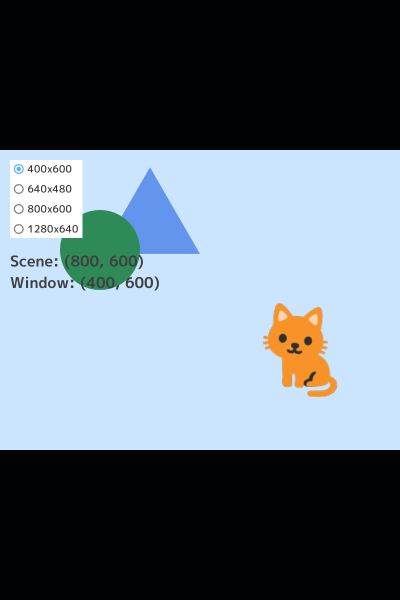
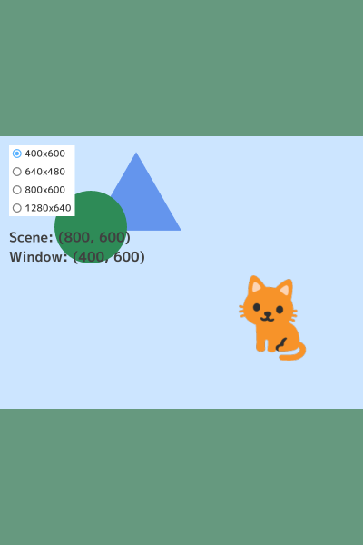
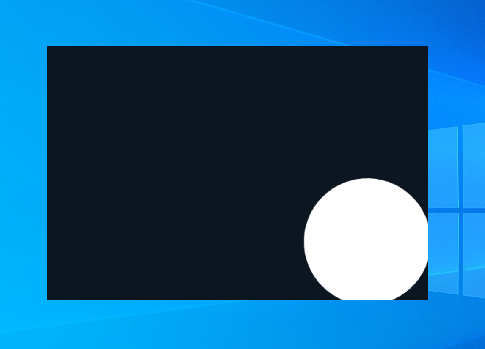

# 10. 画面とウィンドウ

この章では、ウィンドウのサイズやスタイルを変更する方法を学びます。

## 10.1 シーンとウインドウ

図形やテクスチャ、テキストなどを `.draw()` すると、「シーン」と呼ばれる仮想の画面に描画されます。そして、シーンの画像がウィンドウに転送されることで、ユーザは描画された結果を目にすることができます。

シーンの設定やウィンドウへの転送は自動的に行われるので、これまでは特に意識することなく、`.draw()` した内容を表示していました。この章では


```C++

```


## 10.2 



```C++

```


## 10.3



```C++

```


## 10.4


```C++

```


## 10.5


```C++

```


## 10.6


```C++

```


## 10.7


```C++

```


## 10.8



```C++

```


## 10.9


```C++

```


