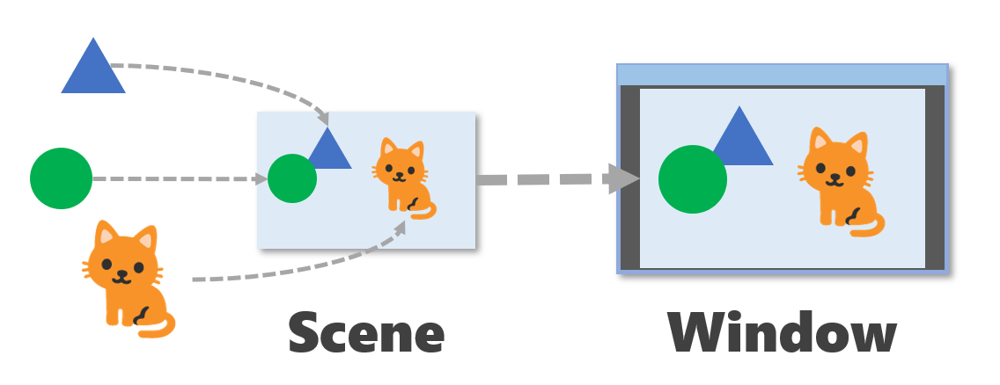

# 10. シーンとウィンドウ

Siv3D では、図形やテクスチャ、テキストなどを `.draw()` すると、「シーン」と呼ばれる仮想の画面に描画されます。そして、シーンの画像がウィンドウに転送されることで、ユーザは描画された結果を目にすることができます。



これらの処理は自動的に行われるため、前章までは特に意識することなく `.draw()` した内容を表示していました。この章ではシーンの設定やウィンドウへの転送をカスタマイズする方法を学びます。


## 10.1 シーンとウィンドウのサイズを変更する
シーンの基本サイズとウィンドウの基本サイズは `Scene::DefaultSceneSize` と `Window::DefaultClientSize` でそれぞれ定義されており、どちらも幅 800 ピクセル、高さ 600 ピクセルです。シーンとウィンドウのサイズを変更するには、`Window::Resize()` で新しいサイズを指定します。

シーンのサイズは `Scene::Size()`, シーンの幅は `Scene::Width()`, シーンの高さは `Scene::Height()`, ウィンドウのサイズは `Window::ClientSize()`, ウィンドウの幅は `Window::ClientWidth()`, ウィンドウの高さは `Window::Height()` で取得できます。


```C++
# include <Siv3D.hpp>

void Main()
{
	Scene::SetBackground(ColorF(0.8, 0.9, 1.0));
	const Texture texture(Emoji(U"🐈"));
	const Font font(30, Typeface::Bold);

	constexpr std::array<Size, 4> resolutions =
	{
		Size(400, 600), Size(640, 480), Size(800, 600), Size(1280, 640)
	};
	size_t index = 2;

	while (System::Update())
	{
		Triangle(300, 150, 200).draw(Palette::Cornflowerblue);
		Circle(200, 200, 80).draw(Palette::Seagreen);
		texture.resized(200).drawAt(600, 400);

		// ラジオボタンが変更されたら
		if (SimpleGUI::RadioButtons(index, { U"400x600", U"640x480", U"800x600", U"1280x640" }, Vec2(20, 20)))
		{
			// ウィンドウサイズを変更（シーンのサイズも同時に変更）
			Window::Resize(resolutions[index]);
		}

		// シーンのサイズとウィンドウのサイズを表示
		font(U"Scene: {}\nWindow: {}"_fmt(Scene::Size(), Window::ClientSize())).draw(20, 200, ColorF(0.25));
	}
}
```


## 10.2 ウィンドウのサイズだけを変更する
ウィンドウのサイズが変更されても、シーンのサイズはそのままにしておきたいケースもあるでしょう。その場合は `Window::Resize()` に `WindowResizeOption::KeepSceneSize` パラメータを指定します。こうすると、`Window::Resize()` してもシーンのサイズは保持されます。シーンは必要に応じて縮小・拡大し、縦横比を保持したままウィンドウに転送され、余った領域（レターボックス）は黒く塗りつぶされます。


```C++
# include <Siv3D.hpp>

void Main()
{
	Scene::SetBackground(ColorF(0.8, 0.9, 1.0));
	const Texture texture(Emoji(U"🐈"));
	const Font font(30, Typeface::Bold);

	constexpr std::array<Size, 4> resolutions =
	{
		Size(400, 600), Size(640, 480), Size(800, 600), Size(1280, 640)
	};
	size_t index = 2;

	while (System::Update())
	{
		Triangle(300, 150, 200).draw(Palette::Cornflowerblue);
		Circle(200, 200, 80).draw(Palette::Seagreen);
		texture.resized(200).drawAt(600, 400);

		if (SimpleGUI::RadioButtons(index, { U"400x600", U"640x480", U"800x600", U"1280x640" }, Vec2(20, 20)))
		{
			// ウィンドウサイズを変更（シーンのサイズは保持）
			Window::Resize(resolutions[index], WindowResizeOption::KeepSceneSize);
		}

		// シーンのサイズとウィンドウのサイズを表示
		font(U"Scene: {}\nWindow: {}"_fmt(Scene::Size(), Window::ClientSize())).draw(20, 200, ColorF(0.25));
	}
}
```


## 10.3 レターボックスの色を変更する


```C++

```


## 10.4 シーンのサイズだけを変更する


```C++

```


## 10.5 ウィンドウを手動でリサイズできるようにする


```C++

```


## 10.6 ウィンドウのタイトルを変更する


```C++

```


## 10.7 ウィンドウを最小化 / 最大化する


```C++

```


## 10.8 ウィンドウの枠を非表示にする


```C++

```


