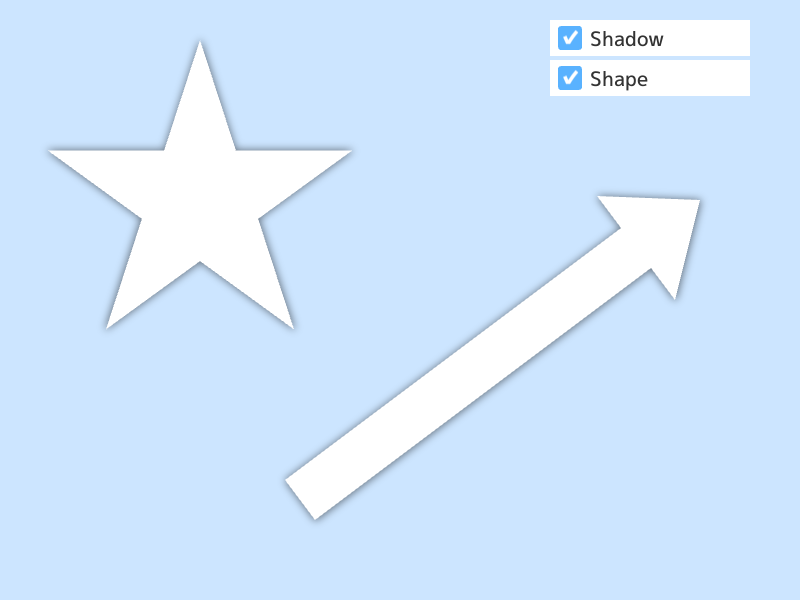

# 2D shadow
`Rect`, `RectF`, `Circle`, `ReoundRect` には `.drawShadow()` が用意されていますが、それ以外の図形の影を描きたい場合は、使い方に応じていくつかの手法を選択して実装する必要があります。

## Baking shadows on texture
影を落とす図形の座標や形状が変化しない場合、シーンと同じ大きさの `Image` にあらかじめ影を焼きこむのが最も簡単な方法です。



```C++
# include <Siv3D.hpp>

void Main()
{
	Scene::SetBackground(ColorF(0.8, 0.9, 1.0));

	const Polygon star = Shape2D::Star(160, Vec2(200, 200));
	const Polygon arrow = Shape2D::Arrow(Vec2(300, 500), Vec2(700, 200), 50, Vec2(80, 80));

	// 影を焼きこむ画像を用意
	constexpr Size canvaSize(800, 600);
	Image shadowImage(canvaSize, Color(255, 0));
	
	// 影を落とす図形を描画
	star.overwrite(shadowImage, Color(255));
	arrow.overwrite(shadowImage, Color(255));

	// 画像にガウシアンブラーを書ける
	shadowImage.gaussianBlur(12);
	
	// 画像からテクスチャを作成
	const Texture texture(shadowImage);

	bool showShadow = true;
	bool showShape = true;

	while (System::Update())
	{
		// 影の描画
		if (showShadow)
		{
			texture.draw(ColorF(0.0, 0.5));
		}

		// 図形の描画
		if (showShape)
		{
			star.draw();
			arrow.draw();
		}

		SimpleGUI::CheckBox(showShadow, U"Shadow", Vec2(550, 20), 200);
		SimpleGUI::CheckBox(showShape, U"Shape", Vec2(550, 60), 200);
	}
}
```
