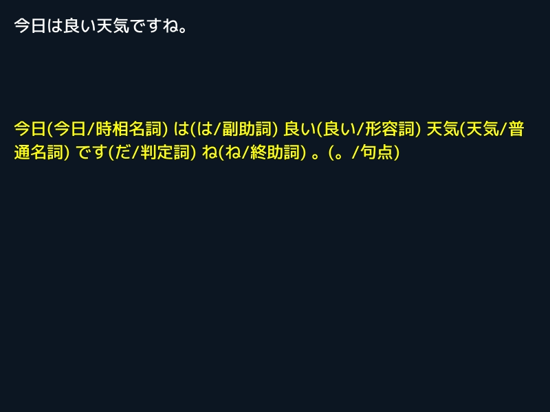

# Natural language processing

## 日本語の形態素解析
プログラムを実行する前に、モデルデータが含まれる `jumanpp-2.0.0-rc2.tar.xz` を https://github.com/ku-nlp/jumanpp/releases からダウンロード・解凍し、`model` フォルダにある `jumandic.jppmdl` (約 450MB) を、プロジェクトの `nlp/japanese/jumanpp` フォルダ（`README.md` と `LICENSE` が入っているフォルダ）にコピーしておく必要があります。

```C++
# include <Siv3D.hpp>

void Main()
{
	// テキスト表示用のフォント
	const Font font(24, Typeface::Medium);

	// 解析対象のテキスト
	String text = U"今日は良い天気ですね。";
	
	// 入力テキストが更新されているか確認するためのデータ
	String previous;

	// 形態素解析の結果をまとめたテキスト
	String result;

	while (System::Update())
	{
		// キーボードからテキストを入力
		TextInput::UpdateText(text);

		// 未変換の入力も取得
		const String current = text + TextInput::GetEditingText();

		// 入力が更新されたら形態素解析を再実行
		if (current != previous)
		{
			// 形態素解析
			const auto morphemes = NLP::Japanese::AnalyzeMorphology(current);

			result.clear();

			// 形態素の情報を取得
			for (const auto& morpheme : morphemes)
			{
				// 空の形態素はスキップ
				if (!morpheme)
				{
					continue;
				}

				// 表層形、見出し語、品詞分類
				result += U"{}({}/{}) "_fmt(morpheme.surface, morpheme.surfaceBase, morpheme.wordSubClassID ? morpheme.wordSubClass : morpheme.wordClass);
			}
		}

		previous = current;

		// テキストを表示
		font(current).draw(Scene::Rect().stretched(-20));

		// 形態素解析の結果を表示
		font(result).draw(Scene::Rect().stretched(-20).movedBy(0, 150), Palette::Yellow);
	}
}
```