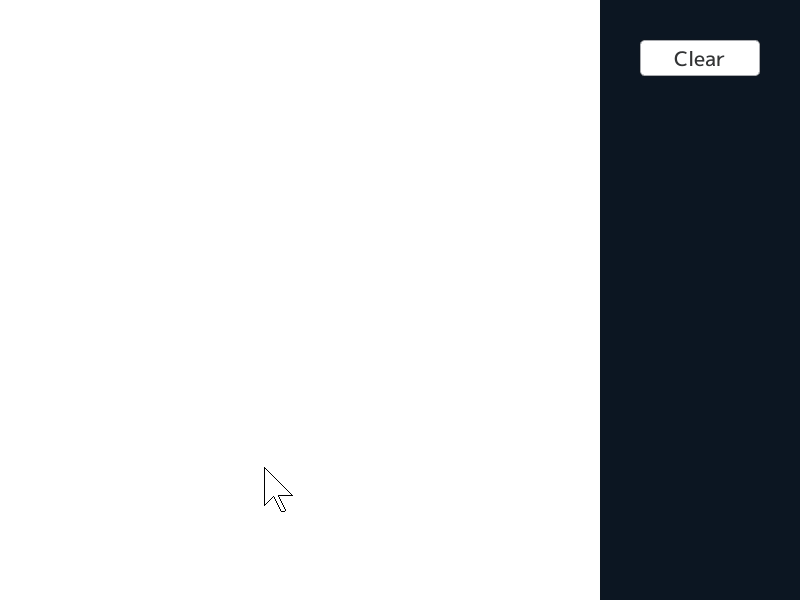
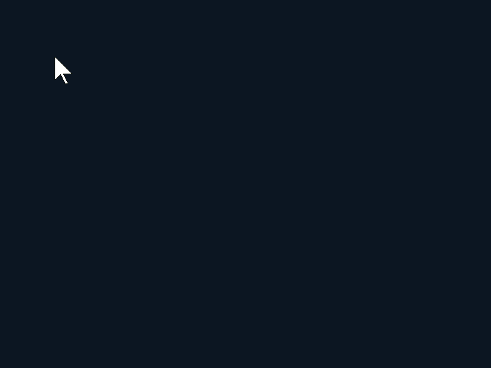
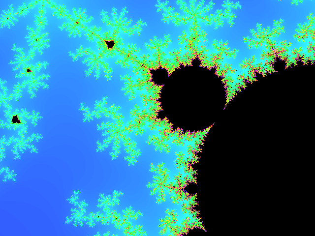

# Application

## Sketch

```C++
# include <Siv3D.hpp>

void Main()
{
	// キャンバスのサイズ
	constexpr Size canvasSize(600, 600);

	// ペンの太さ
	constexpr int32 thickness = 8;

	// ペンの色
	constexpr Color penColor = Palette::Orange;

	// 書き込み用の画像データを用意
	Image image(canvasSize, Palette::White);

	// 表示用のテクスチャ（内容を更新するので DynamicTexture）
	DynamicTexture texture(image);

	while (System::Update())
	{
		if (MouseL.pressed())
		{
			// 書き込む線の始点は直前のフレームのマウスカーソル座標
			// （初回はタッチ操作時の座標のジャンプを防ぐため、現在のマウスカーソル座標にする）
			const Point from = MouseL.down() ? Cursor::Pos() : Cursor::PreviousPos();

			// 書き込む線の終点は現在のマウスカーソル座標
			const Point to = Cursor::Pos();

			// image に線を書き込む
			Line(from, to).overwrite(image, thickness, penColor);

			// 書き込み終わった image でテクスチャを更新
			texture.fill(image);
		}

		// 描いたものを消去するボタンが押されたら
		if (SimpleGUI::Button(U"Clear", Vec2(640, 40), 120))
		{
			// 画像を白で塗りつぶす
			image.fill(Palette::White);

			// 塗りつぶし終わった image でテクスチャを更新
			texture.fill(image);
		}

		// テクスチャを表示
		texture.draw();
	}
}
```

## Piano

```C++
# include <Siv3D.hpp>

void Main()
{
	// 白鍵の大きさ
	constexpr Size keySize(55, 400);

	// 楽器の種類
	constexpr GMInstrument instrument = GMInstrument::Piano1;

	// ウインドウをリサイズ
	Window::Resize(12 * keySize.x, keySize.y);

	// 鍵盤の数
	constexpr int32 NumKeys = 20;

	// 音を作成
	std::array<Audio, NumKeys> sounds;
	for (auto i : step(NumKeys))
	{
		sounds[i] = Audio(Wave(instrument, static_cast<uint8>(PianoKey::A3 + i), 0.5s));
	}

	// 対応するキー
	constexpr std::array<Key, NumKeys> keys =
	{
		KeyTab, Key1, KeyQ,
		KeyW, Key3, KeyE, Key4, KeyR, KeyT, Key6, KeyY, Key7, KeyU, Key8, KeyI,
		KeyO, Key0, KeyP, KeyMinus, KeyGraveAccent,
	};

	// 描画位置計算用のオフセット値
	constexpr std::array<int32, NumKeys> keyPositions =
	{
		0, 1, 2, 4, 5, 6, 7, 8, 10, 11, 12, 13, 14, 15, 16, 18, 19, 20, 21, 22
	};

	while (System::Update())
	{
		// キーが押されたら対応する音を再生
		for (auto i : step(NumKeys))
		{
			if (keys[i].down())
			{
				sounds[i].playOneShot(0.5);
			}
		}

		// 白鍵を描画
		for (auto i : step(NumKeys))
		{
			// オフセット値が偶数
			if (IsEven(keyPositions[i]))
			{
				RectF(keyPositions[i] / 2 * keySize.x, 0, keySize.x, keySize.y)
					.stretched(-1).draw(keys[i].pressed() ? Palette::Pink : Palette::White);
			}
		}

		// 黒鍵を描画
		for (auto i : step(NumKeys))
		{
			// オフセット値が奇数
			if (IsOdd(keyPositions[i]))
			{
				RectF(keySize.x * 0.68 + keyPositions[i] / 2 * keySize.x, 0, keySize.x * 0.58, keySize.y * 0.62)
					.draw(keys[i].pressed() ? Palette::Pink : Color(24));
			}
		}
	}
}
```


## Kaleidoscope sketch

```C++
# include <Siv3D.hpp>

void Main()
{
	// キャンバスのサイズ
	constexpr Size canvasSize(600, 600);

	// 分割数
	constexpr int32 N = 12;

	// 背景色
	constexpr Color backgroundColor(20, 40, 60);

	// ウィンドウをキャンバスのサイズに
	Window::Resize(canvasSize);

	// 書き込み用の画像
	Image image(canvasSize, backgroundColor);

	// 画像を表示するための動的テクスチャ
	DynamicTexture texture(image);

	while (System::Update())
	{
		if (MouseL.pressed())
		{
			// 画面の中心が (0, 0) になるようにマウスカーソルの座標を移動
			const Vec2 begin = (MouseL.down() ? Cursor::PosF() : Cursor::PreviousPosF()) - Scene::Center();
			const Vec2 end = Cursor::PosF() - Scene::Center();

			for (auto i : step(N))
			{
				// 円座標に変換
				std::array<Circular, 2> cs = { begin, end };

				for (auto& c : cs)
				{
					// 角度をずらす
					c.theta = IsEven(i) ? (-c.theta - 2_pi / N * (i - 1)) : (c.theta + 2_pi / N * i);
				}

				// ずらした位置をもとに、画像に線を書き込む
				Line(cs[0], cs[1]).moveBy(Scene::Center())
					.paint(image, 2, HSV(Scene::Time() * 60.0, 0.5, 1.0));
			}

			// 書き込んだ画像でテクスチャを更新
			texture.fillIfNotBusy(image);
		}
		else if (MouseR.down()) // 右クリックされたら
		{
			// 画像を塗りつぶす
			image.fill(backgroundColor);

			// 塗りつぶした画像でテクスチャを更新
			texture.fill(image);
		}

		// テクスチャを描く
		texture.draw();
	}
}
```


## Image to Polygon
<video src="../images/app-image-to-polygon.mp4" autoplay loop muted></video>
```C++
# include <Siv3D.hpp>

void Main()
{
	// 使用する画像
	const Image image(U"example/siv3d-kun.png");

	// アルファ値 1 以上の領域を Polygon 化
	const Polygon polygon = image.alphaToPolygon(1, false);

	// テクスチャ
	const Texture texture(image);

	// 移動のオフセット
	constexpr Vec2 pos(40, 40);

	// Polygon 単純化時の基準距離（ピクセル）
	double maxDistance = 4.0;

	// 単純化した Polygon
	Polygon simplifiedPolygon = polygon.simplified(maxDistance);

	while (System::Update())
	{
		// 単純化した Polygon の頂点数を表示
		ClearPrint();
		Print << simplifiedPolygon.vertices().size() << U" vertices";

		texture.draw(pos);

		// 単純化した Polygon を表示
		simplifiedPolygon.movedBy(pos)
			.draw(ColorF(1.0, 1.0, 0.0, 0.2))
			.drawWireframe(2, Palette::Yellow);

		// 単純化した Polygon をマウスカーソルに追従させて表示
		simplifiedPolygon.movedBy(Cursor::Pos() - image.size() / 2)
			.draw(ColorF(0.5));

		// Polygon 単純化時の基準距離を制御
		if (SimpleGUI::Slider(U"{:.1f}"_fmt(maxDistance), maxDistance, 0.0, 30.0, Vec2(400, 40), 60, 200))
		{
			// スライダーに変更があれば、単純化した Polygon を新しい基準値で再作成
			simplifiedPolygon = polygon.simplified(maxDistance);
		}
	}
}
```


## Sketch to Polygon

```C++
# include <Siv3D.hpp>

void Main()
{
	// キャンバスのサイズ
	constexpr Size canvasSize(800, 600);

	// ペンの太さ
	constexpr int32 thickness = 4;

	// 書き込み用の画像データを用意
	Image image(canvasSize, Color(0, 0));

	// 表示用のテクスチャ（内容を更新するので DynamicTexture）
	DynamicTexture texture(image);

	// 作成した Polygon の配列
	Array<Polygon> polygons;

	while (System::Update())
	{
		// ペンの色
		const Color penColor = HSV(polygons.size() * 20);

		if (MouseL.pressed())
		{
			// 書き込む線の始点は直前のフレームのマウスカーソル座標
			// （初回はタッチ操作時の座標のジャンプを防ぐため、現在のマウスカーソル座標にする）
			const Point from = MouseL.down() ? Cursor::Pos() : Cursor::PreviousPos();

			// 書き込む線の終点は現在のマウスカーソル座標
			const Point to = Cursor::Pos();

			// image に線を書き込む
			Line(from, to).overwrite(image, thickness, penColor);

			// 書き込み終わった image でテクスチャを更新
			texture.fill(image);
		}
		else if (MouseL.up())
		{
			// 画像の非透過部分から Polygon を作成（穴無し）
			if (const Polygon polygon = image.alphaToPolygon(1, false))
			{
				// 少し単純化してから追加
				polygons << polygon.simplified(2.0);
			}

			// 画像データをリセット
			image.fill(Color(0, 0));

			// テクスチャを更新
			texture.fill(image);
		}

		// それぞれの Polygon を描画
		for (auto [i, polygon] : Indexed(polygons))
		{
			polygon.draw(HSV(i * 20, 0.4, 1.0))
				.drawWireframe(1, Palette::Gray)
				.drawFrame(4, HSV(i * 20));
		}

		// テクスチャを表示
		texture.draw();
	}
}
```


## Audio player
<video src="../images/app-audio-player.mp4" autoplay loop muted></video>
```C++
# include <Siv3D.hpp>

void Main()
{
	// 音楽
	Audio audio;

	// FFT の結果
	FFTResult fft;

	// 再生位置の変更の有無
	bool hasChanged = false;

	while (System::Update())
	{
		// 再生・演奏時間
		const String time = FormatTime(SecondsF(audio.posSec()), U"M:ss")
			+ U'/' + FormatTime(SecondsF(audio.lengthSec()), U"M:ss");

		// プログレスバーの進み具合
		double progress = static_cast<double>(audio.posSample()) / audio.samples();

		if (audio.isPlaying())
		{
			// FFT 解析
			FFT::Analyze(fft, audio);

			// 結果を可視化
			for (auto i : step(800))
			{
				const double size = Pow(fft.buffer[i], 0.6f) * 1000;
				RectF(Arg::bottomLeft(i, 480), 1, size).draw(HSV(240 - i));
			}

			// 周波数表示
			Rect(Cursor::Pos().x, 0, 1, Scene::Height()).draw();
			ClearPrint();
			Print << U"{} Hz"_fmt(Cursor::Pos().x * fft.resolution);
		}

		// 再生
		if (SimpleGUI::Button(U"Play", Vec2(40, 500), 120, audio && !audio.isPlaying()))
		{
			audio.play(0.2s);
		}

		// 一時停止
		if (SimpleGUI::Button(U"Pause", Vec2(170, 500), 120, audio.isPlaying()))
		{
			audio.pause(0.2s);
		}

		// フォルダから音楽ファイルを開く
		if (SimpleGUI::Button(U"Open", Vec2(300, 500), 120))
		{
			audio.stop(0.5s);
			audio = Dialog::OpenAudio();
			audio.play();
		}

		// スライダー
		if (SimpleGUI::Slider(time, progress, Vec2(40, 540), 130, 590, !audio.isEmpty()))
		{
			audio.pause(0.1s);

			// 再生位置を変更
			audio.setPosSample(static_cast<int64>(audio.samples() * progress));
			
			// ノイズを避けるため、スライダーから手を離すまで再生は再開しない
			hasChanged = true;
		}
		else if (hasChanged && MouseL.up())
		{
			// 再生を再開
			audio.play(0.1s);
			hasChanged = false;
		}
	}
}
```


## Text to Polygon
<video src="../images/app-text-to-polygon.mp4" autoplay loop muted></video>
```C++
# include <Siv3D.hpp>

// テキストを画像に書き込んで Polygon 化する関数
MultiPolygon MakePolygons(const Font& font, const String& text)
{
	Image image(1200, 200, Color(0, 0));

	font(text).overwrite(image, 0, 0, Color(255));

	return image.alphaToPolygons().simplified(1).movedBy(-400, -500).scaled(0.025);
}

void Main()
{
	Window::Resize(1280, 720);
	Scene::SetBackground(ColorF(0.94, 0.91, 0.86));

	const Font font(100, Typeface::Bold);

	// 物理演算の　ワールド
	P2World world;

	// 床
	const P2Body line = world.createStaticLine(Vec2(0, 0), Line(-16, 0, 16, 0), P2Material(1, 0.1, 1.0));
	
	// 文字のパーツ
	Array<P2Body> bodies;

	String text;
	int32 generation = 0;
	HashTable<P2BodyID, int32> table;

	// 2D カメラ
	Camera2D camera(Vec2(0, -5), 38, Camera2DParameters::MouseOnly());

	while (System::Update())
	{
		// テキストの入力
		TextInput::UpdateText(text);

		// 物理演算ワールドの更新
		world.update(Scene::DeltaTime(), 30, 10);

		// 2D カメラの更新
		camera.update();
		{
			// 2D カメラを適用する Transformer2D の作成
			auto t = camera.createTransformer();

			// 世代に応じた色で Body を描画
			for (const auto& body : bodies)
			{
				body.draw(HSV(table[body.id()] * 45 + 30, 0.8, 0.8));
			}

			// 床を描画
			line.draw(Palette::Green);

			// 入力文字を描画
			{
				Transformer2D trans(Mat3x2::Scale(0.025));

				font(text + TextInput::GetEditingText()).draw(-400, -500, ColorF(0.5));
			}

			// 改行文字が入力されたらテキストを Body 化させる
			if (text.includes(U'\n'))
			{
				for (const auto& poly : MakePolygons(font, text))
				{
					const Vec2 centroid = poly.centroid();

					bodies << world.createPolygon(centroid, poly.movedBy(-centroid), P2Material(1, 0.0, 0.4));

					// 現在の世代を保存
					table[bodies.back().id()] = generation;
				}

				text.clear();

				// 世代を進める
				++generation;
			}

			// 2D カメラ、右クリック時の UI を表示
			camera.draw(Palette::Orange);
		}

		// 消去ボタン
		if (SimpleGUI::Button(U"Clear", Vec2(1100, 40)))
		{
			bodies.clear();
		}
	}
}
```


## マンデルブロ集合

```C++
# include <Siv3D.hpp>

int32 Mandelbrot(double x, double y)
{
	double a = 0.0, b = 0.0;

	for (int32 n = 0; n < 360; ++n)
	{
		const double t = a * a - b * b + x;
		const double u = 2.0 * a * b + y;

		if (t * t + u * u > 4.0)
		{
			return n;
		}

		a = t;
		b = u;
	}

	return 0;
}

void Main()
{
	constexpr Size resolutuion(640, 480);
	Window::Resize(resolutuion);

	Vec2 center(0, 0);
	double scale = -4.0;

	// 結果を保存する画像
	Image image(resolutuion, Palette::Black);

	// 描画用の動的テクスチャ
	DynamicTexture texture(image);

	while (System::Update())
	{
		const double wheel = Mouse::Wheel();
		const bool clicked = MouseL.down();

		// 最初のフレームか、操作されたときだけ更新
		if (wheel || clicked || (Scene::FrameCount() == 1))
		{
			scale -= wheel;

			const double s = Pow(1.25, scale);
			const double d = (1.0 / s) / resolutuion.x;

			if (clicked)
			{
				center += (Cursor::PosF() - resolutuion / 2) * d;
			}

			const double xb = center.x - d * (resolutuion.x * 0.5);
			const double yb = center.y - d * (resolutuion.y * 0.5);

			for (auto y : step(resolutuion.y))
			{
				const double yPos = yb + (d * y);

				for (auto x : step(resolutuion.x))
				{
					const double xPos = xb + (d * x);

					const int32 m = Mandelbrot(xPos, yPos);

					image[y][x] = m ? HSV(240 - m, 0.8, 1.0) : HSV(Color(0));
				}
			}

			// 動的テクスチャの中身を image で更新
			texture.fill(image);
		}

		// テクスチャを描画
		texture.draw();
	}
}
```


## ライフゲーム エディタ

```C++
# include <Siv3D.hpp>

// 1 セルが 1 バイトになるよう、ビットフィールドを使用
struct Cell
{
	bool previous : 1;
	bool current : 1;
};

// フィールドをランダムなセル値で埋める関数
void RandomFill(Grid<Cell>& grid)
{
	grid.fill({ 0,0 });

	// 境界のセルを除いて更新
	for (auto y : Range(1, grid.height() - 2))
	{
		for (auto x : Range(1, grid.width() - 2))
		{
			grid[y][x] = { 0, RandomBool(0.5) };
		}
	}
}

// フィールドの状態を更新する関数
void Update(Grid<Cell>& grid)
{
	for (auto& cell : grid)
	{
		cell.previous = cell.current;
	}

	// 境界のセルを除いて更新
	for (auto y : Range(1, grid.height() - 2))
	{
		for (auto x : Range(1, grid.width() - 2))
		{
			const int32 c = grid[y][x].previous;

			int32 n = 0;
			n += grid[y - 1][x - 1].previous;
			n += grid[y - 1][x].previous;
			n += grid[y - 1][x + 1].previous;
			n += grid[y][x - 1].previous;
			n += grid[y][x + 1].previous;
			n += grid[y + 1][x - 1].previous;
			n += grid[y + 1][x].previous;
			n += grid[y + 1][x + 1].previous;

			// セルの状態の更新
			grid[y][x].current = (c == 0 && n == 3) || (c == 1 && (n == 2 || n == 3));
		}
	}
}

// フィールドの状態を画像化する関数
void CopyToImage(const Grid<Cell>& grid, Image& image)
{
	for (auto y : step(image.height()))
	{
		for (auto x : step(image.width()))
		{
			image[y][x] = grid[y + 1][x + 1].current
				? Color(0, 255, 0) : Palette::Black;
		}
	}
}

void Main()
{
	// フィールドのセルの数（横）
	constexpr int32 width = 60;

	// フィールドのセルの数（縦）
	constexpr int32 height = 60;

	// 計算をしない境界部分も含めたサイズで二次元配列を確保
	Grid<Cell> grid(width + 2, height + 2, { 0,0 });
	
	// フィールドの状態を可視化するための画像
	Image image(width, height, Palette::Black);
	
	// 動的テクスチャ
	DynamicTexture texture(image);

	Stopwatch s(true);

	// 自動再生
	bool autoStep = false;
	
	// 更新頻度
	double speed = 0.5;
	
	// グリッドの表示
	bool showGrid = true;
	
	// 画像の更新の必要があるか
	bool updated = false;

	while (System::Update())
	{
		// フィールドをランダムな値で埋めるボタン
		if (SimpleGUI::ButtonAt(U"Random", Vec2(700, 40), 170))
		{
			RandomFill(grid);
			updated = true;
		}

		// フィールドのセルをすべてゼロにするボタン
		if (SimpleGUI::ButtonAt(U"Clear", Vec2(700, 80), 170))
		{
			grid.fill({ 0, 0 });
			updated = true;
		}

		// 一時停止 / 再生ボタン
		if (SimpleGUI::ButtonAt(autoStep ? U"Pause" : U"Run ▶", Vec2(700, 160), 170))
		{
			autoStep = !autoStep;
		}

		// 更新頻度変更スライダー
		SimpleGUI::SliderAt(U"Speed", speed, 1.0, 0.1, Vec2(700, 200), 70, 100);

		// 1 ステップ進めるボタン、または更新タイミングの確認
		if (SimpleGUI::ButtonAt(U"Step", Vec2(700, 240), 170)
			|| (autoStep && s.sF() >= (speed * speed)))
		{
			Update(grid);
			updated = true;
			s.restart();
		}

		// グリッド表示の有無を指定するチェックボックス
		SimpleGUI::CheckBoxAt(showGrid, U"Grid", Vec2(700, 320), 170);

		// フィールド上でのセルの編集
		if (Rect(0, 0, 599).mouseOver())
		{
			const Point target = Cursor::Pos() / 10 + Point(1, 1);

			if (MouseL.pressed())
			{
				grid[target].current = true;
				updated = true;
			}
			else if (MouseR.pressed())
			{
				grid[target].current = false;
				updated = true;
			}
		}

		// 画像の更新
		if (updated)
		{
			CopyToImage(grid, image);
			texture.fill(image);
			updated = false;
		}

		// 画像をフィルタなしで拡大して表示
		{
			ScopedRenderStates2D sampler(SamplerState::ClampNearest);
			texture.scaled(10).draw();
		}

		// グリッドの表示
		if (showGrid)
		{
			for (auto i : step(61))
			{
				Rect(0, i * 10, 600, 1).draw(ColorF(0.4));
				Rect(i * 10, 0, 1, 600).draw(ColorF(0.4));
			}
		}

		if (Rect(0, 0, 599).mouseOver())
		{
			Cursor::RequestStyle(CursorStyle::Hidden);
			Rect(Cursor::Pos() / 10 * 10, 10).draw(Palette::Orange);
		}
	}
}
```


## QR コード作成

```C++
# include <Siv3D.hpp>

void Main()
{
	Window::Resize(1280, 720);
	const Font font(40, Typeface::Bold);
	
	// QR 変換結果
	QRCode qr;

	// 変換するテキスト
	String text = U"Abc", previous;

	// QR コードを表示するための動的テクスチャ
	DynamicTexture texture;

	while (System::Update())
	{
		// テキスト入力
		TextInput::UpdateText(text);

		const String current = text + TextInput::GetEditingText();

		// テキストの更新があれば QR コードを再作成
		if (current != previous)
		{
			// 入力したテキストを QR コードに変換
			if (QR::EncodeText(qr, current))
			{
				// 枠を付けて拡大した画像で動的テクスチャを更新
				texture.fill(qr.image.border(4).scaled(500, 500, Interpolation::Nearest));
			}
		}

		previous = current;

		font(current).draw(60, 50);

		texture.drawAt(640, 400);
	}
}
```


