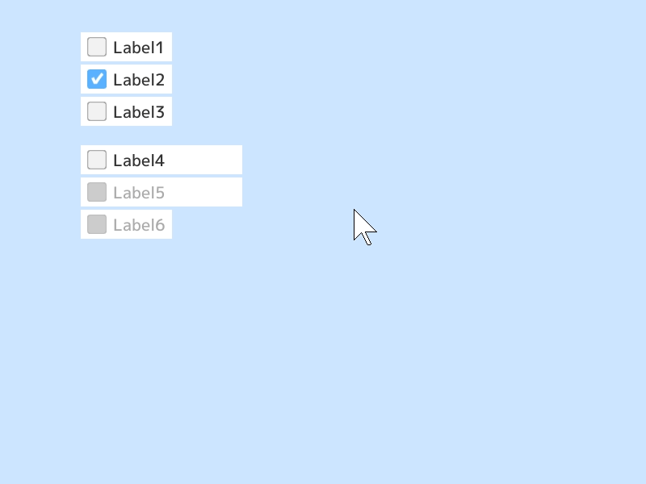
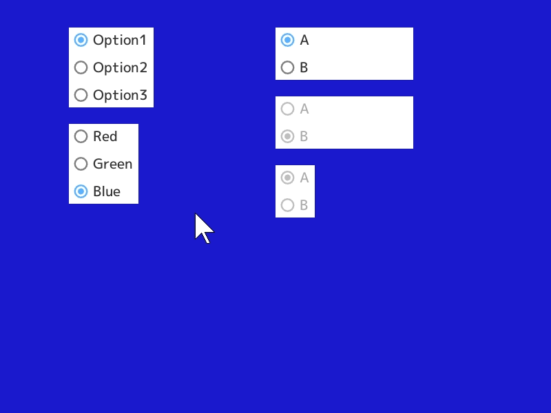
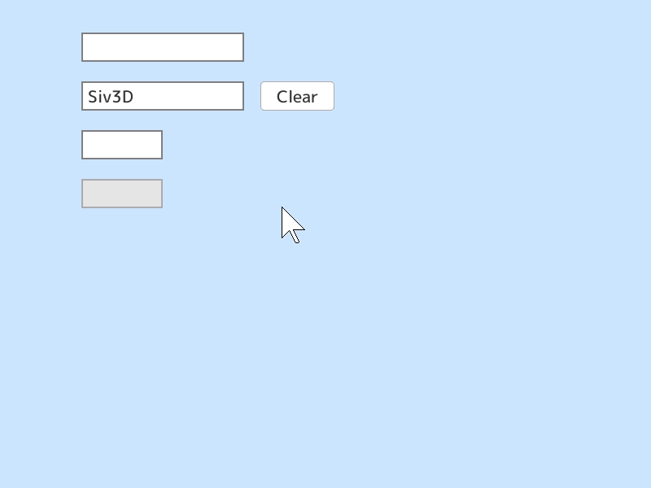

# 9. GUI

この章では、ボタンやスライダーなど簡単な GUI を作成する方法を学びます。

## 9.1 ボタン
ボタンの表示と入力の取得を実装するときは `SimpleGUI::Button()` 関数を使うと便利です。ボタンのテキストや位置、幅、状態などを設定できます。`SimpleGUI::Button()` は自身が押されたときに `true` を返します。


```C++
# include <Siv3D.hpp>

void Main()
{
	while (System::Update())
	{
		if (SimpleGUI::Button(U"Red", Vec2(100, 100)))
		{
			Scene::SetBackground(ColorF(0.8, 0.1, 0.1));
		}

		if (SimpleGUI::Button(U"Green", Vec2(100, 150)))
		{
			Scene::SetBackground(ColorF(0.1, 0.8, 0.1));
		}

		if (SimpleGUI::Button(U"Blue", Vec2(100, 200)))
		{
			Scene::SetBackground(ColorF(0.1, 0.1, 0.8));
		}

		// ボタンの幅を 200px に指定
		if (SimpleGUI::Button(U"White", Vec2(100, 250), 200))
		{
			Scene::SetBackground(ColorF(0.9));
		}

		if (SimpleGUI::Button(U"Black", Vec2(100, 300), 200))
		{
			Scene::SetBackground(ColorF(0.1));
		}

		// ボタンを無効化
		if (SimpleGUI::Button(U"Gray", Vec2(100, 350), 200, false))
		{
			Scene::SetBackground(ColorF(0.5));
		}

		// ボタンを無効化、ボタンの幅はテキストに合わせる
		if (SimpleGUI::Button(U"Yellow", Vec2(100, 400), unspecified, false))
		{
			Scene::SetBackground(ColorF(0.8, 0.8, 0.1));
		}
	}
}
```

## 9.2 スライダー
スライダーの表示と値の取得を実装するときは `SimpleGUI::Slider()` 関数を使うと便利です。スライダーのテキストや位置、幅、値の範囲などを設定できます。縦方向のスライダーは `SimpleGUI::VerticalSlider()` を使います。`SimpleGUI::Slider()` と `SimpleGUI::VerticalSlider()` は値が変更されたときに `true` を返します。


```C++
# include <Siv3D.hpp>

void Main()
{
	Scene::SetBackground(ColorF(0.8, 0.9, 1.0));

	ColorF color1(1.0);
	ColorF color2(1.0, 0.5, 0.0);
	ColorF color3(0.2, 0.6, 0.9);

	double value1 = 5.0;
	double value2 = 7.0;
	double value3 = 2.0;
	double value4 = 4.0;

	while (System::Update())
	{
		SimpleGUI::Slider(color1.r, Vec2(100, 40));
		SimpleGUI::Slider(color1.g, Vec2(100, 80));
		SimpleGUI::Slider(color1.b, Vec2(100, 120));
		Circle(50, 100, 30).draw(color1);

		SimpleGUI::Slider(U"Red", color2.r, Vec2(100, 200));
		SimpleGUI::Slider(U"Green", color2.g, Vec2(100, 240));
		SimpleGUI::Slider(U"Blue", color2.b, Vec2(100, 280));
		Circle(50, 260, 30).draw(color2);

		// スライダーの値を表示、ラベルの幅 100px, スライダーの幅 200px
		SimpleGUI::Slider(U"R {:.2f}"_fmt(color3.r), color3.r, Vec2(100, 360), 100, 200);
		SimpleGUI::Slider(U"G {:.2f}"_fmt(color3.g), color3.g, Vec2(100, 400), 100, 200);
		SimpleGUI::Slider(U"B {:.2f}"_fmt(color3.b), color3.b, Vec2(100, 440), 100, 200);
		Circle(50, 420, 30).draw(color3);

		// 値の範囲が 0.0～10.0
		SimpleGUI::Slider(U"{:.2f}"_fmt(value1), value1, 0.0, 10.0, Vec2(500, 40), 60, 150);

		// スライダーを無効化
		SimpleGUI::Slider(U"{:.2f}"_fmt(value2), value2, 0.0, 10.0, Vec2(500, 100), 60, 150, false);

		// 縦のスライダー
		SimpleGUI::VerticalSlider(value3, 0.0, 10.0, Vec2(500, 160), 200);
		SimpleGUI::VerticalSlider(value4, 0.0, 10.0, Vec2(560, 160), 200, false);
	}
}
```


## 9.3 チェックボックス
チェックボックスの表示と入力の取得を実装するときは `SimpleGUI::CheckBox()` 関数を使うと便利です。チェックボックスのテキストや位置、幅、状態などを設定できます。`SimpleGUI::CheckBox()` は値が変更されたときに `true` を返します。



```C++
# include <Siv3D.hpp>

void Main()
{
	Scene::SetBackground(ColorF(0.8, 0.9, 1.0));

	bool checked1 = false;
	bool checked2 = true;
	bool checked3 = false;
	bool checked4 = false;
	bool checked5 = false;
	bool checked6 = false;

	while (System::Update())
	{
		SimpleGUI::CheckBox(checked1, U"Label1", Vec2(100, 40));
		SimpleGUI::CheckBox(checked2, U"Label2", Vec2(100, 80));
		SimpleGUI::CheckBox(checked3, U"Label3", Vec2(100, 120));

		// 幅 200px
		SimpleGUI::CheckBox(checked4, U"Label4", Vec2(100, 180), 200);

		// 無効化
		SimpleGUI::CheckBox(checked5, U"Label5", Vec2(100, 220), 200, false);

		// 幅はテキストに合わせる
		SimpleGUI::CheckBox(checked6, U"Label6", Vec2(100, 260), unspecified, false);
	}
}
```


## 9.4 ラジオボタン
ラジオボタンの表示と入力の取得を実装するときは `SimpleGUI::RadioButtons()` 関数を使うと便利です。ラジオボタンのテキストや位置、幅、状態などを設定できます。`SimpleGUI::RadioButtons()` は値が変更されたときに `true` を返します。



```C++
# include <Siv3D.hpp>

void Main()
{
	size_t index0 = 0;
	size_t index1 = 2;
	size_t index2 = 0;
	size_t index3 = 1;
	size_t index4 = 0;

	const Array<String> options = { U"Red", U"Green", U"Blue" };
	constexpr std::array<ColorF, 3> colors = { ColorF(0.8, 0.1, 0.1), ColorF(0.1, 0.8, 0.1),ColorF(0.1, 0.1, 0.8) };

	Scene::SetBackground(colors[index1]);

	while (System::Update())
	{
		SimpleGUI::RadioButtons(index0, { U"Option1", U"Option2", U"Option3" }, Vec2(100, 40));

		// 選択肢を Array<String> で指定
		if (SimpleGUI::RadioButtons(index1, options, Vec2(100, 180)))
		{
			Scene::SetBackground(colors[index1]);
		}

		// 幅 200px
		SimpleGUI::RadioButtons(index2, { U"A", U"B" }, Vec2(400, 40), 200);

		// 無効化
		SimpleGUI::RadioButtons(index3, { U"A", U"B" }, Vec2(400, 140), 200, false);

		// 幅はテキストに合わせる
		SimpleGUI::RadioButtons(index4, { U"A", U"B" }, Vec2(400, 240), unspecified, false);
	}
}
```


## 9.5 テキストボックス
テキストボックスを実装するときは `SimpleGUI::TextBox()` 関数を使うと便利です。テキストボックスの位置、幅、文字数の上限、状態などを設定できます。テキストは `TextEditState` 型のオブジェクトによって管理します。`SimpleGUI::TextBox()` は値が変更されたときに `true` を返します。



```C++
# include <Siv3D.hpp>

void Main()
{
	Scene::SetBackground(ColorF(0.8, 0.9, 1.0));

	const Font font(30, Typeface::Bold);

	TextEditState tes1;
	TextEditState tes2;
	tes2.text = U"Siv3D"; // デフォルトの文字列
	TextEditState tes3;
	TextEditState tes4;

	while (System::Update())
	{
		SimpleGUI::TextBox(tes1, Vec2(100, 40));

		// .text でテキストにアクセス、.active でアクティブかどうかの状態にアクセス
		font(tes1.text).draw(400, 30, tes1.active ? ColorF(1.0, 0.0, 0.0) : ColorF(0.25));

		SimpleGUI::TextBox(tes2, Vec2(100, 100));

		if (SimpleGUI::Button(U"Clear", Vec2(320, 100)))
		{
			// テキストを消去
			tes2.clear();
		}

		// 幅 100px, 文字数を 4 文字までに制限
		SimpleGUI::TextBox(tes3, Vec2(100, 160), 100, 4);

		// 無効化
		SimpleGUI::TextBox(tes4, Vec2(100, 220), 100, 4, false);
	}
}
```


